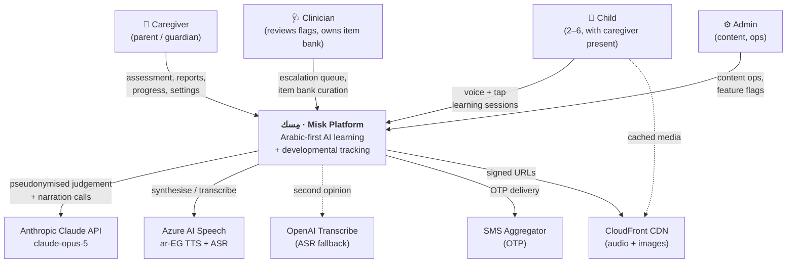
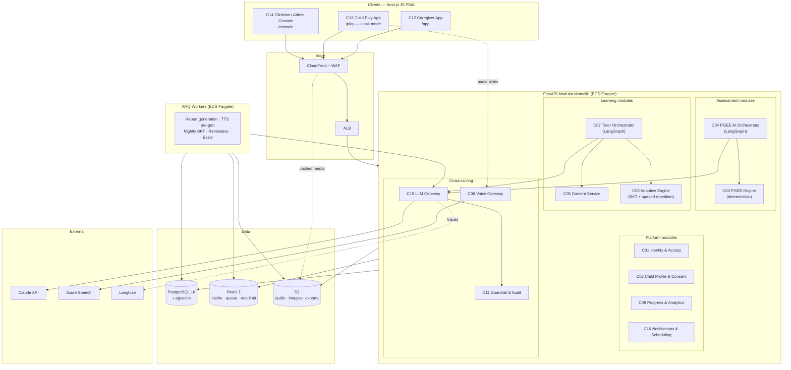
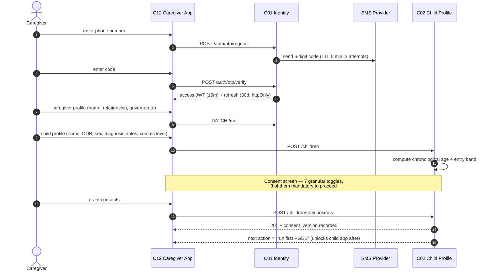
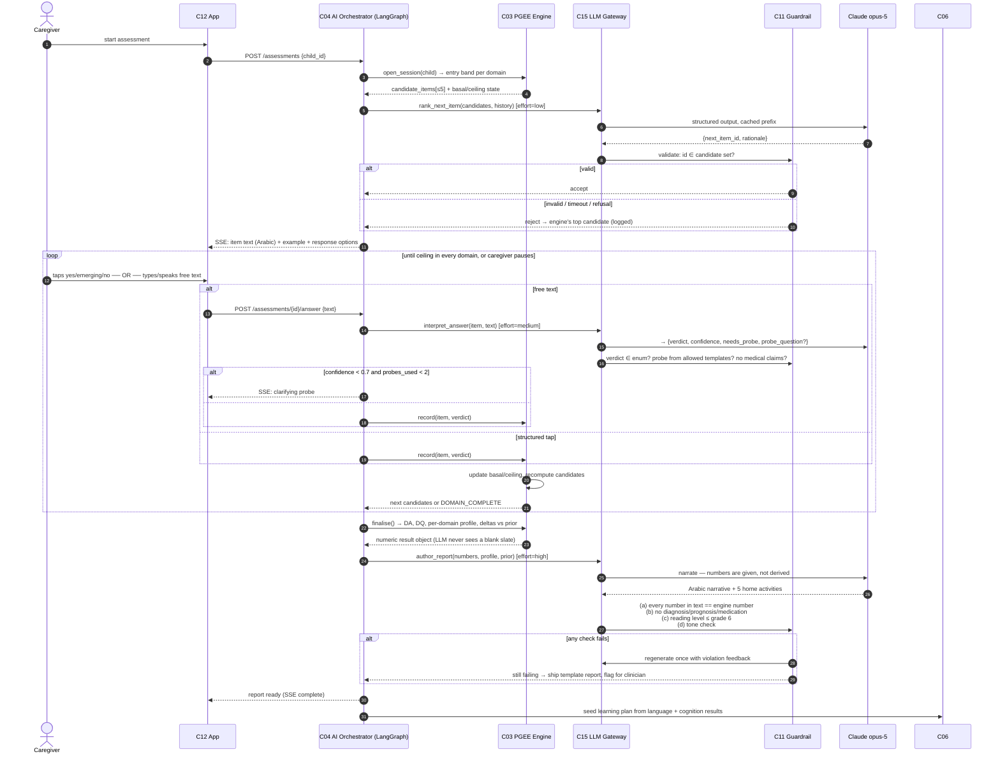
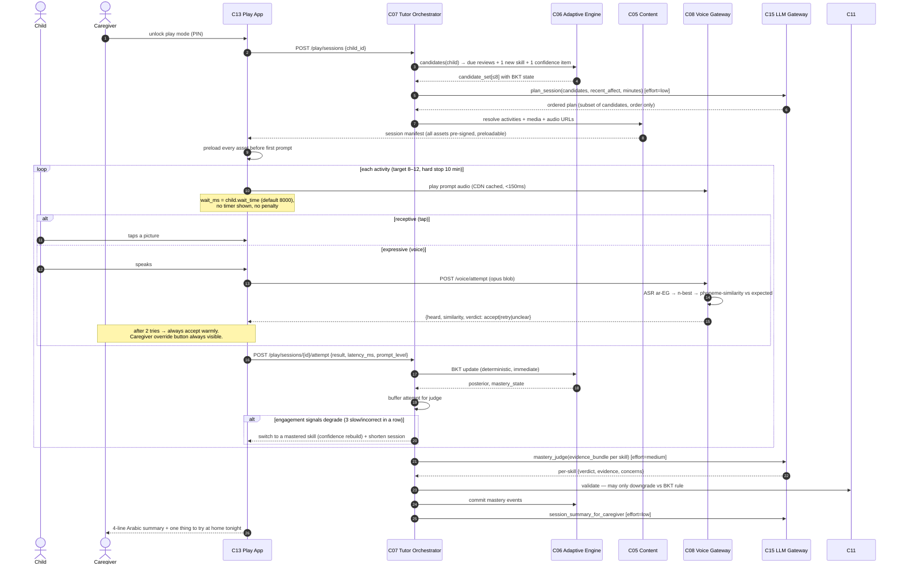
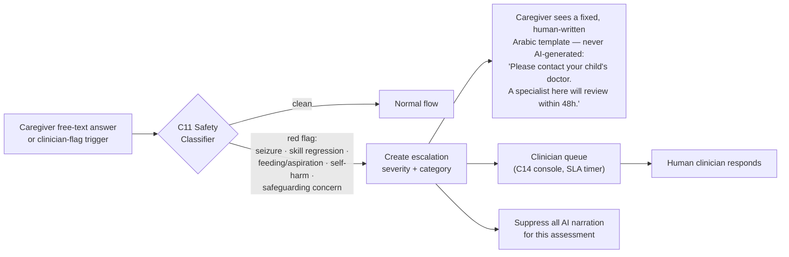

# 01 — High-Level Design

## 1. What the system is

Two products sharing one spine.

**For the caregiver** — a developmental tracking companion. They register, create a child profile, and run an AI-assisted PGEE assessment every six months. The AI interprets their natural-language answers, decides what to ask next, and produces a plain-Arabic report showing how their child is progressing *against their own past self*. Between assessments they see how the child is doing in the learning app and get concrete home-activity suggestions.

**For the child** — a warm, slow, colourful voice companion called **نور (Nour)** that teaches ~90 Arabic concepts (letters, numbers 1–10, colours, body parts, everyday household objects) through short repeated sessions. Nour speaks Egyptian Arabic, waits patiently, never punishes a wrong answer, and quietly adapts what comes next based on a mastery model plus an AI judge.

**The spine** — a deterministic core (scoring, mastery, scheduling) with the LLM wired in at four bounded decision points, wrapped in seven layers of guardrails.

## 2. Architecture principles

| # | Principle | Consequence |
|---|---|---|
| P1 | **Deterministic core, AI at bounded decision points.** | Every user-visible number is computed by tested code. The LLM interprets, ranks, narrates and flags — nothing else. |
| P2 | **The AI may be more conservative, never less.** | A judge can downgrade a mastery verdict or raise a concern. It cannot upgrade past the deterministic threshold. Enforced by a post-hoc validator. |
| P3 | **Closed sets everywhere.** | `next_item_id` must be a member of the candidate set the engine supplied. Out-of-set → discard the LLM output, use the engine's top candidate, log a guardrail event. |
| P4 | **Every AI failure has a silent deterministic fallback.** | Anthropic down, schema violation, timeout, refusal — the session continues. The user never sees an error because of AI. |
| P5 | **The child is never blocked.** | No timers, no fail states, no ASR gate, no dead ends. Every path forward exists in at least two modalities. |
| P6 | **Pseudonymise at the boundary.** | No child name, caregiver name, phone number or address ever leaves the VPC in an LLM prompt. |
| P7 | **Modular monolith, service-shaped.** | One deployable, but every component has an explicit interface and owns its tables. Extraction later is mechanical. |
| P8 | **Arabic-first, not Arabic-translated.** | RTL is the default direction, not a variant. Content is authored in Arabic and reviewed by a native speaker before it exists in the DB. |

## 3. System context (C4 level 1)

## 4. Container view (C4 level 2)

## 5. Component register

| ID | Component | Owns | Doc |
|---|---|---|---|
| C01 | Identity & Access | caregivers, sessions, OTP, RBAC | [04a](04a-components-platform.md) |
| C02 | Child Profile & Consent | children, consents, caregiver-child links | [04a](04a-components-platform.md) |
| C03 | PGEE Assessment Engine | item bank, basal/ceiling, DA/DQ scoring | [04b](04b-components-pgee.md) |
| C04 | PGEE AI Orchestrator | LangGraph assessment session, answer interpretation, report authoring | [04b](04b-components-pgee.md) |
| C05 | Content Service | skills, activities, media, TTS cache manifest | [04c](04c-components-learning.md) |
| C06 | Adaptive Learning Engine | BKT state, spaced repetition, candidate generation | [04c](04c-components-learning.md) |
| C07 | Tutor Orchestrator | LangGraph play session, mastery judge, encouragement | [04c](04c-components-learning.md) |
| C08 | Voice Gateway | TTS synthesis + cache, ASR, pronunciation scoring | [04d](04d-components-voice.md) |
| C09 | Progress & Analytics | events, rollups, caregiver dashboards | [04a](04a-components-platform.md) |
| C10 | Notifications & Scheduling | 6-month reminders, streaks, digests | [04a](04a-components-platform.md) |
| C11 | Guardrail & Audit | output validation, safety classifier, escalations, audit log | [04e](04e-components-safety-clients.md) |
| C12 | Caregiver Web App | Next.js `/app` | [04e](04e-components-safety-clients.md) |
| C13 | Child Play App | Next.js `/play` | [04e](04e-components-safety-clients.md) |
| C14 | Clinician / Admin Console | Next.js `/console` | [04e](04e-components-safety-clients.md) |
| C15 | LLM Gateway | Anthropic client, caching, effort tiers, budget, retries, fallbacks | [04a](04a-components-platform.md) |

## 6. Core flows

### 6.1 Onboarding + consent

### 6.2 AI-assisted PGEE session — the heart of the caregiver product

### 6.3 Child learning session

### 6.4 Escalation (safety)

## 7. Technology choices

| Layer | Choice | Why this and not the alternative |
|---|---|---|
| Frontend | **Next.js 15 App Router + TypeScript + Tailwind + shadcn/ui** | One framework for three apps with different auth surfaces; RSC keeps the caregiver dashboard fast on 3G; PWA via `next-pwa`. Not React Native — see A6. |
| Child-app state | **Zustand + IndexedDB outbox** | The play session must survive a network drop; Redux is overkill, and IndexedDB gives us a durable attempt queue. |
| Backend | **FastAPI (Python 3.12), modular monolith** | The AI stack (LangGraph, Anthropic SDK, audio processing) is Python-first. Microservices at 2,500 users would be self-harm. Modules have hard interfaces so extraction is mechanical later. |
| ORM / migrations | **SQLAlchemy 2.0 (async) + Alembic** | Mature async support; Alembic gives reviewable migrations, which matters when the item bank changes. |
| DB | **PostgreSQL 16 + pgvector** | Relational integrity for clinical data is non-negotiable. pgvector powers the semantic cache for repeated judgements and item-similarity search. |
| Cache / queue | **Redis 7** | Session state, rate limiting, ARQ queue, TTS lookup. |
| Jobs | **ARQ** | Async-native, ~500 lines of concepts, backed by Redis we already run. |
| Orchestration | **LangGraph** | Checkpointed, resumable, interruptible graphs. A caregiver pausing an assessment for two days and resuming is a first-class feature, not a hack. |
| LLM | **Claude `claude-opus-5`**, adaptive thinking, effort-tiered | See [03](03-ai-architecture.md) §2. |
| TTS / ASR | **Azure AI Speech `ar-EG`**, OpenAI transcribe fallback | Only vendor with genuinely Egyptian neural voices. |
| Observability | **OpenTelemetry → Grafana Cloud; Langfuse for LLM traces & evals** | Prompt versioning and eval datasets need a purpose-built tool. |
| Infra | **AWS `me-south-1`, ECS Fargate, Terraform** | Latency + data residency. Budget alternative documented. |
| CI/CD | **GitHub Actions → ECR → ECS blue/green** | Standard, cheap, auditable. |

## 8. Non-functional requirements

### 8.1 Latency budgets (p95, on 4G in Cairo)

| Interaction | Budget | How |
|---|---|---|
| Child app: tap → audio starts | **150 ms** | Every asset preloaded before the session starts; CDN edge in Bahrain/Dubai. |
| Child app: speech end → feedback audio | **2,500 ms** | Client-side VAD endpointing; ASR streaming; feedback audio pre-cached per outcome. |
| Child app: activity → next activity | **400 ms** | Whole session manifest fetched up front; BKT update is fire-and-forget to the outbox. |
| PGEE: answer → next question | **3,000 ms** | `effort=low` for ranking; interpretation runs in parallel with candidate recomputation; the item text streams. |
| PGEE: finalise → report | **45,000 ms** | Async job with a progress screen; push notification when done. Report generation is `effort=high` and must not be rushed. |
| Caregiver dashboard first paint | **1,800 ms** | RSC + pre-computed rollups; no client-side aggregation. |

### 8.2 Availability & resilience

- Target **99.5%** monthly for the caregiver app, **99.9%** for the child app's *offline-capable* path (a fully cached session runs with no backend).
- **Anthropic outage** → PGEE falls back to fully deterministic mode (engine picks items, tap-only answers, template report marked "narrative pending"); play sessions run on the BKT scheduler alone with pre-recorded praise. Nothing breaks; a banner explains the reduced mode.
- **Azure Speech outage** → TTS falls back to the pre-generated cache (covers ~92% of utterances); the rest degrade to on-screen text with a caregiver read-aloud prompt. ASR unavailable → expressive tasks auto-switch to caregiver-confirmation mode.
- **Postgres failover** → Multi-AZ RDS; workers retry with idempotency keys on every write path.

### 8.3 Accessibility (binding, tested in CI)

- WCAG 2.2 AA for the caregiver and console apps.
- Child app exceeds AA where AA is insufficient for this population: **touch targets ≥ 80 × 80 px with ≥ 16 px spacing**, contrast ≥ 7:1 for all text, **no animation above 3 Hz**, no time limits anywhere, reduced-motion honoured, all instruction audio also present as text and as an icon.
- Full RTL, logical CSS properties only (`margin-inline-start`, never `margin-left`).
- Verified by automated `axe-core` runs in CI **and** by manual review with the pilot cohort's occupational therapist.

### 8.4 Cost model (steady state, 2,500 active children)

Per **learning session** (10 min, ~10 activities):

| Item | Volume | Unit | Cost |
|---|---|---|---|
| Claude — session planning | 1 call, effort `low`, ~6k in (5k cached) / 300 out | $5/M in, $0.50/M cached read, $25/M out | $0.014 |
| Claude — mastery judge | 1 batched call, effort `medium`, ~8k in (6k cached) / 900 out | — | $0.036 |
| Claude — session summary | 1 call, effort `low`, ~3k in / 400 out | — | $0.020 |
| Claude — mid-session affect checks | ~2 calls, effort `low` | — | $0.024 |
| ASR | ~60 s of child audio | ~$1.00 / audio-hour | $0.017 |
| TTS | ~8% cache miss × ~40 chars | ~$16 / 1M chars | $0.001 |
| CDN + storage | ~4 MB | — | $0.0004 |
| **Total per session** | | | **≈ $0.11** |

Per **PGEE assessment** (~55 items administered):

| Item | Cost |
|---|---|
| Answer interpretation — 55 calls, effort `medium`, heavy prefix caching | $0.31 |
| Next-item ranking — 55 calls, effort `low` | $0.12 |
| Report authoring — 1 call, effort `high`, ~12k in / 3.5k out | $0.15 |
| Guardrail classifier passes — 8 calls, effort `low` | $0.05 |
| **Total per assessment** | **≈ $0.63** |

**Per child per month:** 20 sessions × $0.11 = $2.20, plus 1/6 of an assessment ≈ $0.11, plus infrastructure amortised ≈ $1.90 → **≈ $4.20/child/month**, inside the $6 ceiling (O4). Infrastructure at this scale is ≈ $480/month on AWS (see [08](08-infrastructure.md)); the Hetzner alternative is ≈ $95/month.

**Cost controls implemented, not merely planned:** per-child daily token budget enforced in C15 with a hard stop and graceful degradation; prompt caching on every prefix (`usage.cache_read_input_tokens` asserted non-zero in CI); the Batch API (50% discount) for all offline work — eval runs, nightly re-scoring, bulk TTS pre-generation.

### 8.5 Security & privacy targets

Covered in [07](07-security-privacy.md). Headline: no PII crosses the LLM boundary; child audio is not retained by default; all clinical writes are append-only and audited; consent is granular and versioned.

## 9. Environments

| Env | Purpose | Data | AI |
|---|---|---|---|
| `local` | Development | Seeded synthetic children | Recorded LLM fixtures by default; live with `AI_LIVE=1` |
| `ci` | Automated tests | Ephemeral Postgres | **Fixtures only** — no network calls in unit/contract tests |
| `eval` | Prompt & model evaluation | Golden datasets | Live, via Batch API |
| `staging` | Integration + UAT rehearsal | Anonymised synthetic cohort | Live, budget-capped |
| `production` | Pilot then GA | Real | Live |

A **feature-flag kill switch** exists for every AI decision point (`ai.pgee.next_item`, `ai.pgee.interpret`, `ai.pgee.report`, `ai.tutor.plan`, `ai.tutor.judge`, `ai.tutor.summary`, `ai.voice.asr`). Flipping any of them off drops that decision to its deterministic fallback without a deploy. This is the single most valuable operational lever in the system.
