# 02 — Data Model

PostgreSQL 16. All timestamps `timestamptz`, all IDs `uuid` (v7 for time-sortability via `uuid_generate_v7()` from `pg_uuidv7`, falling back to `gen_random_uuid()`). All clinical writes are append-only.

## 1. Entity relationship overview

```mermaid
erDiagram
    CAREGIVER ||--o{ CAREGIVER_CHILD : "linked via"
    CHILD ||--o{ CAREGIVER_CHILD : "linked via"
    CHILD ||--o{ CONSENT : has
    CHILD ||--o{ ASSESSMENT : undergoes
    CHILD ||--o{ SKILL_STATE : "has mastery state for"
    CHILD ||--o{ PLAY_SESSION : plays
    CHILD ||--o{ ESCALATION : "may trigger"

    ASSESSMENT ||--o{ ASSESSMENT_RESPONSE : contains
    ASSESSMENT ||--o{ ASSESSMENT_DOMAIN_SCORE : produces
    ASSESSMENT ||--|| ASSESSMENT_REPORT : produces
    ASSESSMENT_ITEM ||--o{ ASSESSMENT_RESPONSE : "answered as"
    ASSESSMENT_DOMAIN ||--o{ ASSESSMENT_ITEM : groups
    ASSESSMENT_BAND ||--o{ ASSESSMENT_ITEM : "banded by"

    SKILL ||--o{ SKILL_PREREQUISITE : "requires"
    SKILL ||--o{ ACTIVITY : "taught by"
    SKILL ||--o{ SKILL_STATE : "tracked by"
    SKILL ||--o{ MASTERY_EVENT : "evidenced by"
    ACTIVITY_TEMPLATE ||--o{ ACTIVITY : instantiates
    ACTIVITY ||--o{ ATTEMPT : "attempted in"
    MEDIA_ASSET ||--o{ ACTIVITY : "illustrated by"

    PLAY_SESSION ||--o{ ATTEMPT : contains
    PLAY_SESSION ||--o{ MASTERY_EVENT : "may emit"

    AI_CALL ||--o{ GUARDRAIL_EVENT : "may raise"
```



## 2. Enumerated types

```sql
CREATE TYPE caregiver_role      AS ENUM ('owner', 'co_caregiver', 'therapist');
CREATE TYPE child_sex           AS ENUM ('male', 'female', 'unspecified');
CREATE TYPE comms_level         AS ENUM ('preverbal', 'single_words', 'two_word', 'phrases', 'sentences');
CREATE TYPE consent_status      AS ENUM ('granted', 'withdrawn');
CREATE TYPE assessment_status   AS ENUM ('draft', 'in_progress', 'paused', 'scoring', 'completed', 'abandoned', 'flagged');
CREATE TYPE response_verdict    AS ENUM ('yes', 'emerging', 'no', 'not_applicable', 'skipped');
CREATE TYPE response_source     AS ENUM ('caregiver_tap', 'caregiver_text', 'caregiver_voice', 'clinician_override', 'evidence_propagated');
CREATE TYPE domain_code         AS ENUM ('infant_stim', 'socialization', 'language', 'self_help', 'cognitive', 'motor');
CREATE TYPE skill_category      AS ENUM ('letters', 'numbers', 'colors', 'body_parts', 'household', 'social');
CREATE TYPE activity_kind       AS ENUM ('listen_point', 'match_pair', 'say_it', 'sort_category', 'story_moment');
CREATE TYPE modality            AS ENUM ('receptive', 'expressive', 'productive');
CREATE TYPE mastery_state       AS ENUM ('not_started', 'introduced', 'practising', 'mastered', 'retained', 'lapsed');
CREATE TYPE attempt_result      AS ENUM ('correct', 'incorrect', 'no_response', 'accepted_on_effort', 'caregiver_confirmed');
CREATE TYPE prompt_level        AS ENUM ('independent', 'gestural', 'partial_verbal', 'full_model');
CREATE TYPE ai_decision_point   AS ENUM ('pgee_next_item','pgee_interpret','pgee_probe','pgee_report',
                                         'tutor_plan','tutor_judge','tutor_summary','safety_classify');
CREATE TYPE guardrail_outcome   AS ENUM ('pass', 'repaired', 'rejected_fallback', 'blocked_escalated');
CREATE TYPE escalation_category AS ENUM ('seizure','regression','feeding_aspiration','self_harm','safeguarding',
                                         'medical_advice_requested','distress','other');
CREATE TYPE escalation_status   AS ENUM ('open', 'acknowledged', 'resolved', 'dismissed');
CREATE TYPE tts_voice           AS ENUM ('nour_child', 'narrator_caregiver');
```

## 3. Identity, profile & consent

```sql
CREATE TABLE caregivers (
    id                uuid PRIMARY KEY DEFAULT uuid_generate_v7(),
    phone_e164        text UNIQUE,                       -- +20...
    email             citext UNIQUE,
    password_hash     text,                              -- argon2id; null when phone-only
    display_name      text NOT NULL DEFAULT '',
    relationship      text,                              -- 'mother','father','grandparent','therapist',...
    governorate       text,
    locale            text NOT NULL DEFAULT 'ar-EG',
    play_pin_hash     text,                              -- argon2id; gates exit from child kiosk mode
    is_active         boolean NOT NULL DEFAULT true,
    last_login_at     timestamptz,
    created_at        timestamptz NOT NULL DEFAULT now(),
    updated_at        timestamptz NOT NULL DEFAULT now(),
    CONSTRAINT caregiver_has_identifier CHECK (phone_e164 IS NOT NULL OR email IS NOT NULL)
);

CREATE TABLE auth_otp (
    id            uuid PRIMARY KEY DEFAULT uuid_generate_v7(),
    phone_e164    text NOT NULL,
    code_hash     text NOT NULL,                         -- sha256(code || pepper)
    attempts      smallint NOT NULL DEFAULT 0,
    consumed_at   timestamptz,
    expires_at    timestamptz NOT NULL,
    created_ip    inet,
    created_at    timestamptz NOT NULL DEFAULT now()
);
CREATE INDEX ON auth_otp (phone_e164, created_at DESC);

CREATE TABLE refresh_tokens (
    id            uuid PRIMARY KEY DEFAULT uuid_generate_v7(),
    caregiver_id  uuid NOT NULL REFERENCES caregivers(id) ON DELETE CASCADE,
    token_hash    text NOT NULL UNIQUE,
    family_id     uuid NOT NULL,                         -- rotation family; reuse ⇒ revoke family
    user_agent    text,
    revoked_at    timestamptz,
    expires_at    timestamptz NOT NULL,
    created_at    timestamptz NOT NULL DEFAULT now()
);

CREATE TABLE children (
    id                    uuid PRIMARY KEY DEFAULT uuid_generate_v7(),
    display_name          text NOT NULL,                 -- given name only, never a full name
    name_vowelised        text,                          -- with tashkeel, for TTS
    date_of_birth         date NOT NULL,
    sex                   child_sex NOT NULL DEFAULT 'unspecified',
    gestational_weeks     smallint,                      -- for corrected age under 24 months
    diagnosis_note        text,                          -- free text, caregiver's words; never parsed for dx
    comms_level           comms_level NOT NULL DEFAULT 'single_words',
    -- accessibility profile, learned and adjustable
    wait_time_ms          integer NOT NULL DEFAULT 8000 CHECK (wait_time_ms BETWEEN 3000 AND 20000),
    max_choices           smallint NOT NULL DEFAULT 2   CHECK (max_choices BETWEEN 2 AND 4),
    audio_rate_pct        smallint NOT NULL DEFAULT 85  CHECK (audio_rate_pct BETWEEN 60 AND 110),
    calm_mode             boolean NOT NULL DEFAULT false,   -- reduced colour, no sfx, no confetti
    session_minutes       smallint NOT NULL DEFAULT 8   CHECK (session_minutes BETWEEN 3 AND 15),
    hearing_aid           boolean NOT NULL DEFAULT false,
    glasses               boolean NOT NULL DEFAULT false,
    archived_at           timestamptz,
    created_at            timestamptz NOT NULL DEFAULT now(),
    updated_at            timestamptz NOT NULL DEFAULT now()
);

CREATE TABLE caregiver_child (
    caregiver_id  uuid NOT NULL REFERENCES caregivers(id) ON DELETE CASCADE,
    child_id      uuid NOT NULL REFERENCES children(id)   ON DELETE CASCADE,
    role          caregiver_role NOT NULL DEFAULT 'owner',
    invited_by    uuid REFERENCES caregivers(id),
    accepted_at   timestamptz,
    created_at    timestamptz NOT NULL DEFAULT now(),
    PRIMARY KEY (caregiver_id, child_id)
);
CREATE INDEX ON caregiver_child (child_id);

-- Consent definitions are seed data so the wording is versioned and auditable.
CREATE TABLE consent_definitions (
    key            text PRIMARY KEY,      -- see seed below
    version        integer NOT NULL,
    text_ar        text NOT NULL,
    text_en        text NOT NULL,
    is_mandatory   boolean NOT NULL,
    effective_from timestamptz NOT NULL DEFAULT now()
);

CREATE TABLE consents (
    id             uuid PRIMARY KEY DEFAULT uuid_generate_v7(),
    child_id       uuid NOT NULL REFERENCES children(id) ON DELETE CASCADE,
    caregiver_id   uuid NOT NULL REFERENCES caregivers(id),
    consent_key    text NOT NULL REFERENCES consent_definitions(key),
    version        integer NOT NULL,
    status         consent_status NOT NULL,
    granted_at     timestamptz NOT NULL DEFAULT now(),
    withdrawn_at   timestamptz,
    source_ip      inet,
    user_agent     text
);
CREATE INDEX ON consents (child_id, consent_key, granted_at DESC);
```

**Seeded consent keys** (`is_mandatory` in bold):

| Key | Purpose | Mandatory |
|---|---|---|
| `data_processing` | Store the child's profile and progress | **yes** |
| `ai_processing` | Send pseudonymised text to Anthropic for assessment support | **yes** |
| `terms_not_medical` | Acknowledge this is not a diagnostic or medical service | **yes** |
| `voice_asr` | Send the child's speech for transcription (not retained) | no |
| `voice_retention` | Keep 30 days of audio to improve recognition for this child | no |
| `clinician_share` | Share reports with a linked clinician | no |
| `research_aggregate` | Use fully anonymised, aggregated data for research | no |

Declining `voice_asr` disables expressive voice tasks and substitutes tap equivalents — the product still works completely.

## 4. Assessment (PGEE)

```sql
CREATE TABLE assessment_domains (
    code         domain_code PRIMARY KEY,
    name_ar      text NOT NULL,
    name_en      text NOT NULL,
    sort_order   smallint NOT NULL
);

CREATE TABLE assessment_bands (
    id             smallint PRIMARY KEY,     -- 0..5
    label          text NOT NULL,            -- '0-1','1-2',...
    min_months     smallint NOT NULL,
    max_months     smallint NOT NULL
);

CREATE TABLE assessment_items (
    id              uuid PRIMARY KEY DEFAULT uuid_generate_v7(),
    bank_version    text NOT NULL,                        -- 'synthetic-v1' | 'portage-licensed-v1'
    external_ref    text,                                 -- item number in the source manual
    domain_code     domain_code NOT NULL REFERENCES assessment_domains(code),
    band_id         smallint NOT NULL REFERENCES assessment_bands(id),
    sequence        integer NOT NULL,                     -- order within (domain, band)
    -- what the caregiver reads
    prompt_ar       text NOT NULL,                        -- "بيقدر يمسك الكوباية بإيد واحدة؟"
    prompt_ar_msa   text NOT NULL,
    example_ar      text,                                 -- concrete example so the answer is observable
    criterion_ar    text NOT NULL,                        -- what counts as "yes"
    -- machine-usable metadata
    observable_cue  text NOT NULL,                        -- given to the LLM interpreter as scoring criteria
    implies_pass    uuid[] NOT NULL DEFAULT '{}',         -- evidence propagation: a yes here implies yes on these
    implied_by      uuid[] NOT NULL DEFAULT '{}',
    linked_skills   uuid[] NOT NULL DEFAULT '{}',         -- → skills.id, seeds the learning plan
    is_active       boolean NOT NULL DEFAULT true,
    reviewed_by     text,                                 -- clinician sign-off
    reviewed_at     timestamptz,
    created_at      timestamptz NOT NULL DEFAULT now(),
    UNIQUE (bank_version, domain_code, band_id, sequence)
);
CREATE INDEX ON assessment_items (bank_version, domain_code, band_id, sequence) WHERE is_active;

-- Rules live in data, not code, because a licensed manual may differ (assumption B3).
CREATE TABLE assessment_rules (
    bank_version        text PRIMARY KEY,
    basal_consecutive   smallint NOT NULL DEFAULT 8,
    ceiling_consecutive smallint NOT NULL DEFAULT 6,
    entry_band_offset   smallint NOT NULL DEFAULT -1,     -- bands below chronological age for a first run
    emerging_credit     numeric(3,2) NOT NULL DEFAULT 0.50,
    max_probes_per_item smallint NOT NULL DEFAULT 2,
    min_days_between    integer  NOT NULL DEFAULT 150,
    scatter_credit_mult numeric(3,2) NOT NULL DEFAULT 0.50
);

CREATE TABLE assessments (
    id                 uuid PRIMARY KEY DEFAULT uuid_generate_v7(),
    child_id           uuid NOT NULL REFERENCES children(id) ON DELETE CASCADE,
    caregiver_id       uuid NOT NULL REFERENCES caregivers(id),
    bank_version       text NOT NULL REFERENCES assessment_rules(bank_version),
    sequence_no        integer NOT NULL,                   -- 1st, 2nd, ... for this child
    status             assessment_status NOT NULL DEFAULT 'draft',
    chronological_months numeric(5,2) NOT NULL,            -- frozen at start
    entry_bands        jsonb NOT NULL,                     -- {"language": 1, "motor": 2, ...}
    graph_checkpoint   jsonb,                              -- LangGraph state for resume
    ai_degraded        boolean NOT NULL DEFAULT false,     -- ran without AI (fallback mode)
    started_at         timestamptz NOT NULL DEFAULT now(),
    completed_at       timestamptz,
    duration_seconds   integer,
    UNIQUE (child_id, sequence_no)
);
CREATE INDEX ON assessments (child_id, started_at DESC);

CREATE TABLE assessment_responses (
    id                uuid PRIMARY KEY DEFAULT uuid_generate_v7(),
    assessment_id     uuid NOT NULL REFERENCES assessments(id) ON DELETE CASCADE,
    item_id           uuid NOT NULL REFERENCES assessment_items(id),
    verdict           response_verdict NOT NULL,
    source            response_source NOT NULL,
    raw_text          text,                                -- caregiver's own words, stored for audit
    ai_confidence     numeric(3,2),
    ai_rationale      text,
    probes_used       smallint NOT NULL DEFAULT 0,
    superseded_by     uuid REFERENCES assessment_responses(id),  -- append-only corrections
    answered_at       timestamptz NOT NULL DEFAULT now(),
    latency_ms        integer,
    UNIQUE (assessment_id, item_id, answered_at)
);
CREATE INDEX ON assessment_responses (assessment_id, item_id);

CREATE TABLE assessment_domain_scores (
    assessment_id      uuid NOT NULL REFERENCES assessments(id) ON DELETE CASCADE,
    domain_code        domain_code NOT NULL,
    items_administered smallint NOT NULL,
    passes             smallint NOT NULL,
    emerging           smallint NOT NULL,
    fails              smallint NOT NULL,
    basal_band         smallint,
    ceiling_band       smallint,
    developmental_age_months numeric(5,2) NOT NULL,
    developmental_quotient   numeric(5,2) NOT NULL,
    delta_da_months    numeric(5,2),                       -- vs previous assessment
    computed_at        timestamptz NOT NULL DEFAULT now(),
    PRIMARY KEY (assessment_id, domain_code)
);

CREATE TABLE assessment_reports (
    assessment_id      uuid PRIMARY KEY REFERENCES assessments(id) ON DELETE CASCADE,
    narrative_ar       text NOT NULL,
    strengths_ar       jsonb NOT NULL,                     -- string[]
    focus_areas_ar     jsonb NOT NULL,                     -- string[]
    home_activities    jsonb NOT NULL,                     -- [{title_ar, steps_ar[], skill_ids[], minutes}]
    is_template        boolean NOT NULL DEFAULT false,     -- true ⇒ AI narration failed, template shipped
    ai_call_id         uuid,
    clinician_reviewed_by text,
    clinician_reviewed_at timestamptz,
    generated_at       timestamptz NOT NULL DEFAULT now()
);
```

## 5. Learning content

```sql
CREATE TABLE media_assets (
    id            uuid PRIMARY KEY DEFAULT uuid_generate_v7(),
    kind          text NOT NULL,                 -- 'image' | 'audio' | 'video'
    s3_key        text NOT NULL UNIQUE,
    mime_type     text NOT NULL,
    width         integer, height integer, duration_ms integer,
    bytes         integer NOT NULL,
    alt_text_ar   text NOT NULL,                 -- accessibility, mandatory
    checksum      text NOT NULL,
    license_note  text,
    created_at    timestamptz NOT NULL DEFAULT now()
);

CREATE TABLE skills (
    id                uuid PRIMARY KEY DEFAULT uuid_generate_v7(),
    code              text NOT NULL UNIQUE,      -- 'letter_alef', 'num_3', 'color_red', 'body_eye', 'hh_toothbrush'
    category          skill_category NOT NULL,
    label_ar          text NOT NULL,             -- display, unvowelised: "أسد"
    label_vowelised   text NOT NULL,             -- TTS: "أَسَد"
    label_egy         text NOT NULL,             -- Egyptian colloquial if different from MSA
    transliteration   text NOT NULL,             -- 'asad' — for logs and phoneme mapping
    phonemes          text NOT NULL,             -- IPA or SAMPA, used by the similarity scorer
    difficulty_tier   smallint NOT NULL CHECK (difficulty_tier BETWEEN 1 AND 5),
    hero_media_id     uuid REFERENCES media_assets(id),
    distractor_pool   uuid[] NOT NULL DEFAULT '{}',   -- skill ids that make good wrong answers
    intro_order       integer NOT NULL,               -- default teaching sequence
    is_active         boolean NOT NULL DEFAULT true,
    created_at        timestamptz NOT NULL DEFAULT now()
);

CREATE TABLE skill_prerequisites (
    skill_id       uuid NOT NULL REFERENCES skills(id) ON DELETE CASCADE,
    requires_id    uuid NOT NULL REFERENCES skills(id) ON DELETE CASCADE,
    PRIMARY KEY (skill_id, requires_id),
    CHECK (skill_id <> requires_id)
);

CREATE TABLE activity_templates (
    id               uuid PRIMARY KEY DEFAULT uuid_generate_v7(),
    code             text NOT NULL UNIQUE,        -- 'listen_point_2choice'
    kind             activity_kind NOT NULL,
    modality         modality NOT NULL,
    choice_count     smallint NOT NULL DEFAULT 2,
    instruction_ar   text NOT NULL,               -- "وريني {label}"  — ≤5 words after substitution
    success_audio_pool jsonb NOT NULL,            -- ["برافو!","شاطر أوي!",...]
    retry_audio_pool   jsonb NOT NULL,            -- gentle, never corrective
    min_tier         smallint NOT NULL DEFAULT 1,
    is_active        boolean NOT NULL DEFAULT true
);

CREATE TABLE activities (
    id             uuid PRIMARY KEY DEFAULT uuid_generate_v7(),
    template_id    uuid NOT NULL REFERENCES activity_templates(id),
    skill_id       uuid NOT NULL REFERENCES skills(id),
    distractors    uuid[] NOT NULL,               -- resolved skill ids
    prompt_audio_id uuid REFERENCES media_assets(id),   -- pre-generated TTS
    est_seconds    smallint NOT NULL DEFAULT 25,
    is_active      boolean NOT NULL DEFAULT true,
    UNIQUE (template_id, skill_id)
);
CREATE INDEX ON activities (skill_id) WHERE is_active;

-- Pre-generated + on-demand TTS, keyed by content hash so it is generated at most once, ever.
CREATE TABLE tts_cache (
    cache_key      text PRIMARY KEY,             -- sha256(voice|rate|pitch|ssml_text)
    voice          tts_voice NOT NULL,
    ssml_text      text NOT NULL,
    plain_text     text NOT NULL,
    media_id       uuid NOT NULL REFERENCES media_assets(id),
    provider       text NOT NULL,
    hit_count      integer NOT NULL DEFAULT 0,
    created_at     timestamptz NOT NULL DEFAULT now(),
    last_hit_at    timestamptz
);
```

## 6. Learning progress

```sql
CREATE TABLE skill_states (
    child_id            uuid NOT NULL REFERENCES children(id) ON DELETE CASCADE,
    skill_id            uuid NOT NULL REFERENCES skills(id),
    modality            modality NOT NULL,
    -- Bayesian Knowledge Tracing
    p_known             numeric(5,4) NOT NULL DEFAULT 0.1500,
    p_transit           numeric(5,4) NOT NULL DEFAULT 0.2500,
    p_slip              numeric(5,4) NOT NULL DEFAULT 0.2500,   -- elevated for this population
    p_guess             numeric(5,4) NOT NULL DEFAULT 0.5000,   -- 1/choice_count, updated per attempt
    -- spaced repetition (SM-2 derived, gentled)
    interval_days       numeric(6,2) NOT NULL DEFAULT 1,
    ease_factor         numeric(4,2) NOT NULL DEFAULT 2.30,
    due_at              timestamptz NOT NULL DEFAULT now(),
    -- mastery bookkeeping
    state               mastery_state NOT NULL DEFAULT 'not_started',
    distinct_days       smallint NOT NULL DEFAULT 0,
    last_delayed_pass_at timestamptz,
    consecutive_correct smallint NOT NULL DEFAULT 0,
    total_attempts      integer NOT NULL DEFAULT 0,
    total_correct       integer NOT NULL DEFAULT 0,
    avg_latency_ms      integer,
    first_seen_at       timestamptz,
    updated_at          timestamptz NOT NULL DEFAULT now(),
    PRIMARY KEY (child_id, skill_id, modality)
);
CREATE INDEX ON skill_states (child_id, due_at) WHERE state <> 'not_started';

CREATE TABLE play_sessions (
    id                uuid PRIMARY KEY DEFAULT uuid_generate_v7(),
    child_id          uuid NOT NULL REFERENCES children(id) ON DELETE CASCADE,
    started_by        uuid NOT NULL REFERENCES caregivers(id),
    plan              jsonb NOT NULL,             -- ordered activity ids as planned
    plan_source       text NOT NULL,              -- 'ai' | 'deterministic_fallback'
    graph_checkpoint  jsonb,
    activities_done   smallint NOT NULL DEFAULT 0,
    correct_count     smallint NOT NULL DEFAULT 0,
    ended_reason      text,                       -- 'completed'|'fatigue'|'caregiver_ended'|'timeout'|'disconnect'
    summary_ar        text,
    started_at        timestamptz NOT NULL DEFAULT now(),
    ended_at          timestamptz
);
CREATE INDEX ON play_sessions (child_id, started_at DESC);

CREATE TABLE attempts (
    id               uuid PRIMARY KEY DEFAULT uuid_generate_v7(),
    session_id       uuid NOT NULL REFERENCES play_sessions(id) ON DELETE CASCADE,
    child_id         uuid NOT NULL REFERENCES children(id) ON DELETE CASCADE,
    activity_id      uuid NOT NULL REFERENCES activities(id),
    skill_id         uuid NOT NULL REFERENCES skills(id),
    modality         modality NOT NULL,
    attempt_no       smallint NOT NULL DEFAULT 1,        -- within the activity
    result           attempt_result NOT NULL,
    prompt_level     prompt_level NOT NULL DEFAULT 'independent',
    latency_ms       integer,
    choice_count     smallint NOT NULL,
    selected_skill_id uuid REFERENCES skills(id),        -- which picture they tapped
    asr_heard        text,                               -- expressive only, pseudonymous
    asr_similarity   numeric(4,3),
    asr_provider     text,
    client_ts        timestamptz NOT NULL,
    created_at       timestamptz NOT NULL DEFAULT now(),
    idempotency_key  text NOT NULL UNIQUE                -- client-generated; survives offline replay
);
CREATE INDEX ON attempts (child_id, skill_id, created_at DESC);
CREATE INDEX ON attempts (session_id, created_at);

CREATE TABLE mastery_events (
    id              uuid PRIMARY KEY DEFAULT uuid_generate_v7(),
    child_id        uuid NOT NULL REFERENCES children(id) ON DELETE CASCADE,
    skill_id        uuid NOT NULL REFERENCES skills(id),
    modality        modality NOT NULL,
    from_state      mastery_state NOT NULL,
    to_state        mastery_state NOT NULL,
    p_known_at_event numeric(5,4) NOT NULL,
    rule_satisfied  boolean NOT NULL,           -- deterministic criterion met?
    ai_verdict      text,                       -- 'confirm' | 'withhold' | 'unavailable'
    ai_reason       text,
    ai_call_id      uuid,
    session_id      uuid REFERENCES play_sessions(id),
    created_at      timestamptz NOT NULL DEFAULT now(),
    CONSTRAINT ai_cannot_grant CHECK (to_state <> 'mastered' OR rule_satisfied = true)
);
```

> The `ai_cannot_grant` check constraint is principle **P2** enforced by the database. Even a bug in application code cannot let an AI verdict promote a child to `mastered` without the deterministic rule being satisfied.

## 7. AI, guardrails, audit

```sql
CREATE TABLE ai_calls (
    id                uuid PRIMARY KEY DEFAULT uuid_generate_v7(),
    decision_point    ai_decision_point NOT NULL,
    child_id          uuid REFERENCES children(id) ON DELETE SET NULL,
    correlation_id    uuid NOT NULL,                -- ties to the assessment / play session
    model             text NOT NULL,                -- 'claude-opus-5'
    effort            text NOT NULL,                -- 'low'|'medium'|'high'
    prompt_version    text NOT NULL,                -- Langfuse prompt label
    request_redacted  jsonb NOT NULL,               -- post-pseudonymisation, exactly what we sent
    response_raw      jsonb,
    stop_reason       text,
    input_tokens      integer, output_tokens integer,
    cache_read_tokens integer, cache_write_tokens integer,
    cost_usd          numeric(10,6),
    latency_ms        integer,
    outcome           text NOT NULL,                -- 'ok'|'schema_error'|'timeout'|'refusal'|'budget_exceeded'|'flag_off'
    retry_count       smallint NOT NULL DEFAULT 0,
    created_at        timestamptz NOT NULL DEFAULT now()
) PARTITION BY RANGE (created_at);

CREATE TABLE guardrail_events (
    id             uuid PRIMARY KEY DEFAULT uuid_generate_v7(),
    ai_call_id     uuid REFERENCES ai_calls(id) ON DELETE CASCADE,
    layer          text NOT NULL,      -- 'schema'|'allowlist'|'numeric_equality'|'safety_classifier'|
                                       -- 'reading_level'|'pii_leak'|'monotonicity'
    outcome        guardrail_outcome NOT NULL,
    detail         jsonb NOT NULL,
    created_at     timestamptz NOT NULL DEFAULT now()
);
CREATE INDEX ON guardrail_events (layer, outcome, created_at DESC);

CREATE TABLE escalations (
    id              uuid PRIMARY KEY DEFAULT uuid_generate_v7(),
    child_id        uuid NOT NULL REFERENCES children(id) ON DELETE CASCADE,
    caregiver_id    uuid NOT NULL REFERENCES caregivers(id),
    category        escalation_category NOT NULL,
    severity        smallint NOT NULL CHECK (severity BETWEEN 1 AND 3),
    trigger_source  text NOT NULL,              -- 'safety_classifier'|'keyword'|'caregiver_report'|'clinician'
    excerpt         text NOT NULL,              -- the triggering text, retained for the clinician
    status          escalation_status NOT NULL DEFAULT 'open',
    sla_due_at      timestamptz NOT NULL,
    acknowledged_by text, acknowledged_at timestamptz,
    resolution_note text, resolved_at timestamptz,
    created_at      timestamptz NOT NULL DEFAULT now()
);
CREATE INDEX ON escalations (status, sla_due_at);

CREATE TABLE audit_log (
    id            bigserial PRIMARY KEY,
    actor_type    text NOT NULL,               -- 'caregiver'|'clinician'|'system'|'worker'
    actor_id      uuid,
    action        text NOT NULL,               -- 'child.create','consent.withdraw','assessment.finalise',...
    entity_type   text NOT NULL,
    entity_id     uuid,
    before        jsonb, after jsonb,
    ip            inet, user_agent text,
    created_at    timestamptz NOT NULL DEFAULT now()
) PARTITION BY RANGE (created_at);
```

## 8. Analytics, notifications, ops

```sql
CREATE TABLE events (                             -- first-party telemetry only
    id           bigserial,
    child_id     uuid, caregiver_id uuid,
    name         text NOT NULL,                   -- 'play.activity.shown','pgee.item.answered',...
    props        jsonb NOT NULL DEFAULT '{}',
    client_ts    timestamptz, server_ts timestamptz NOT NULL DEFAULT now()
) PARTITION BY RANGE (server_ts);

CREATE TABLE progress_rollups (                   -- refreshed nightly + on session end
    child_id            uuid NOT NULL REFERENCES children(id) ON DELETE CASCADE,
    period              text NOT NULL,            -- 'day:2026-08-29' | 'week:2026-W35' | 'all'
    sessions            integer NOT NULL DEFAULT 0,
    minutes             integer NOT NULL DEFAULT 0,
    attempts            integer NOT NULL DEFAULT 0,
    accuracy            numeric(4,3),
    skills_mastered     integer NOT NULL DEFAULT 0,
    skills_practising   integer NOT NULL DEFAULT 0,
    by_category         jsonb NOT NULL DEFAULT '{}',
    updated_at          timestamptz NOT NULL DEFAULT now(),
    PRIMARY KEY (child_id, period)
);

CREATE TABLE notifications (
    id            uuid PRIMARY KEY DEFAULT uuid_generate_v7(),
    caregiver_id  uuid NOT NULL REFERENCES caregivers(id) ON DELETE CASCADE,
    child_id      uuid REFERENCES children(id) ON DELETE CASCADE,
    kind          text NOT NULL,        -- 'pgee_due','weekly_digest','report_ready','escalation_ack','streak'
    payload       jsonb NOT NULL,
    channel       text NOT NULL,        -- 'push'|'sms'|'in_app'
    scheduled_for timestamptz NOT NULL,
    sent_at       timestamptz, read_at timestamptz,
    dedupe_key    text UNIQUE
);
CREATE INDEX ON notifications (scheduled_for) WHERE sent_at IS NULL;

CREATE TABLE feature_flags (
    key           text PRIMARY KEY,     -- 'ai.pgee.next_item', 'ai.tutor.judge', ...
    enabled       boolean NOT NULL DEFAULT true,
    rollout_pct   smallint NOT NULL DEFAULT 100,
    note          text,
    updated_by    text, updated_at timestamptz NOT NULL DEFAULT now()
);

CREATE TABLE cost_ledger (                        -- per-child budget enforcement
    child_id     uuid NOT NULL REFERENCES children(id) ON DELETE CASCADE,
    day          date NOT NULL,
    llm_usd      numeric(10,6) NOT NULL DEFAULT 0,
    asr_usd      numeric(10,6) NOT NULL DEFAULT 0,
    tts_usd      numeric(10,6) NOT NULL DEFAULT 0,
    calls        integer NOT NULL DEFAULT 0,
    PRIMARY KEY (child_id, day)
);
```

## 9. Retention & partitioning

| Table | Partition | Retention | Notes |
|---|---|---|---|
| `events` | monthly | 13 months | Then aggregated into `progress_rollups` and dropped. |
| `ai_calls` | monthly | 12 months | `request_redacted` is already pseudonymised. |
| `audit_log` | monthly | 7 years | Legal/clinical audit trail. |
| child audio (S3) | — | **30 days**, only with `voice_retention` consent | Lifecycle rule; default is delete-on-transcribe. |
| `attempts` | — | Life of the child record | Small, and the basis of every progress claim. |
| assessments & reports | — | Life of the child record | Append-only, never hard-deleted except on erasure request. |

Right-to-erasure runs as a job: hard-delete `children` (cascades), tombstone `audit_log` actor references, purge S3 by prefix, and delete `ai_calls` rows by `child_id`. Aggregate rollups are anonymised rather than deleted.

## 10. Seed data specification

### 10.1 Curriculum — 88 skills

| Category | Count | Contents |
|---|---|---|
| `letters` | 28 | Arabic alphabet أ ب ت … ي. Each with letter name, letter sound, and a keyword word + image (أ → أَسَد, ب → بَطَّة, ت → تُفَّاحة …). Taught as whole-word sight recognition first, letter sound second. |
| `numbers` | 10 | ١–١٠, each with quantity image (dot arrays) and numeral glyph. |
| `colors` | 10 | أحمر، أزرق، أصفر، أخضر، أبيض، أسود، برتقالي، بني، وردي، بنفسجي |
| `body_parts` | 10 | راس، شعر، عين، ودن، مناخير، بُق، سنان، إيد، رجل، بطن |
| `household` | 20 | فرشة سنان، معجون، صابونة، فوطة، شوكة، معلقة، سكينة، طبق، كوباية، كوبّاية مية، كرسي، ترابيزة، سرير، مخدة، باب، شباك، جزمة، شنطة، لبس، مشط |
| `social` | 10 | صباح الخير، مع السلامة، شكراً، من فضلك، أيوه، لأ، تعالى، بابا، ماما، اسمي |

Distractor pools are hand-curated per skill so the wrong answers are perceptually and semantically distinct — this is what makes errorless learning work. A red card must never sit next to an orange card at tier 1.

### 10.2 Activity templates — 9

`listen_point_2choice`, `listen_point_3choice`, `listen_point_4choice`, `match_pair_picture`, `match_pair_word`, `say_it_word`, `say_it_repeat_after`, `sort_category_2bin`, `story_moment_3frame`.

### 10.3 Assessment bank

Ships as `synthetic-v1`: 120 items (20 per domain, spread across bands 0–5), clinically plausible, watermarked `NOT FOR CLINICAL USE`, sufficient to exercise basal/ceiling/scoring end to end. Replaced by `portage-licensed-v1` at go-live (see [O1](00-assumptions.md#open-questions)).

### 10.4 TTS pre-generation manifest

At build time, one job enumerates: every `skills.label_vowelised` (88), every `activity_templates.instruction_ar` × every skill (≈ 500), every success/retry line (60), every PGEE item prompt (120), and every UI utterance (80) → **≈ 850 audio files**, ~35 MB as 48 kbps Opus. Generated once via the Azure batch path, stored in S3, referenced by `tts_cache`, invalidated only by content hash change.
