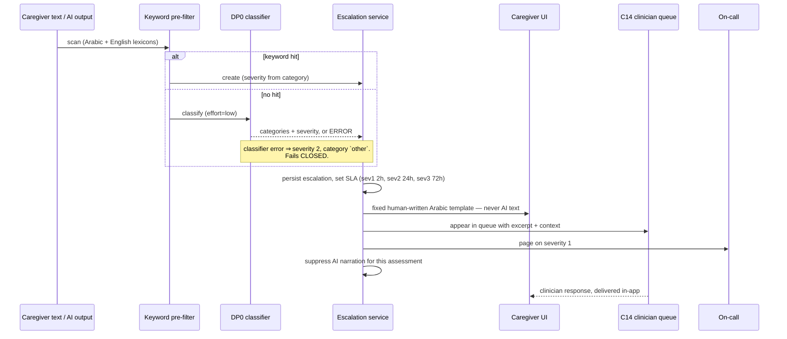

# 04e — Components: Safety & Client Applications

Covers **C11 Guardrail & Audit**, **C12 Caregiver Web App**, **C13 Child Play App**, **C14 Clinician / Admin Console**.

---

## C11 — Guardrail & Audit Service

### Purpose
The component that says no. It is a library used by C15 plus a small set of routes for the escalation workflow, and it is the reason this product can be launched to families.

### Structure

```
app/guardrails/
  chain.py             composable GuardrailChain
  layers/
    schema.py          L2
    allowlist.py       L3
    numeric.py         L4
    safety.py          L5  (keyword pre-filter + DP0 classifier)
    conservatism.py    L6
    reading_level.py   auxiliary
    pii_leak.py        auxiliary — scans outputs for anything that looks identifying
  escalation.py        L7
  redaction.py         L1
  tests/
    redteam/           the suite that must pass 100%
```

Each layer is a pure function `(value, context) -> value` that either returns the value, returns a repaired value, or raises `GuardrailRejection(layer, detail)`. Chains are declared per decision point:

```python
CHAINS = {
  "pgee_interpret": GuardrailChain([SchemaLayer(InterpretResult), VerdictEnumLayer(),
                                    ProbeAllowlistLayer(), RedFlagLayer(), PiiLeakLayer()]),
  "pgee_next_item": GuardrailChain([SchemaLayer(RankResult), CandidateSetLayer()]),
  "pgee_report":    GuardrailChain([SchemaLayer(ReportResult), NumericFidelityLayer(),
                                    ClinicalSafetyLayer(), ReadingLevelLayer(max_grade=6),
                                    PiiLeakLayer()]),
  "tutor_plan":     GuardrailChain([SchemaLayer(PlanResult), CandidateSetLayer(),
                                    PlanConstraintsLayer()]),
  "tutor_judge":    GuardrailChain([SchemaLayer(JudgeResult), ConservatismLayer()]),
  "tutor_summary":  GuardrailChain([SchemaLayer(SummaryResult), NumericFidelityLayer(),
                                    ClinicalSafetyLayer(), PiiLeakLayer()]),
}
```

Every rejection writes a `guardrail_events` row. Layers are individually unit-tested with adversarial inputs, and the chain composition itself is tested — a chain missing `ClinicalSafetyLayer` on a user-visible prose output is a build failure, asserted by a test that enumerates decision points against a required-layer table.

### The escalation workflow



The caregiver-facing text for every category is **written by a human, reviewed by the clinical partner, and stored as a constant**. Example for `regression`:

> لاحظنا إنك ذكرت إن {{CHILD}} كان بيعمل حاجة وبقى مش بيعملها.
> ده حاجة مهم إن دكتور {{CHILD}} يعرفها. من فضلك كلّميه في أقرب وقت.
> إحنا هنا للتعلّم واللعب بس، مش بديل عن الدكتور. متخصص من عندنا هيتواصل معاكي خلال ٤٨ ساعة.

No model generates that. Ever.

### Audit
Every clinical write (`assessment_responses`, `assessment_domain_scores`, `assessment_reports`, `mastery_events`, `consents`) emits an `audit_log` row with before/after. `audit_log` is append-only, enforced by a trigger that rejects `UPDATE` and `DELETE`, and partitioned monthly with 7-year retention.

### Definition of done
Red-team suite 100%. A test proves that with **every** LLM call stubbed to return maximally unsafe content, nothing unsafe reaches a user-visible surface. The `ai_cannot_grant` DB constraint is verified by a test that attempts the illegal write directly through SQL.

---

## C12 — Caregiver Web App

**Route:** `/app` · **Stack:** Next.js 15 App Router, RSC-first, Tailwind, shadcn/ui, `next-intl`, RTL default.

### Information architecture

```
/app
  /onboarding          phone → OTP → profile → child → consent → first assessment
  /                    Today: last session, streak, next action, one suggestion
  /child/[id]
    /skills            88-skill map, grouped by category, coloured by state
    /journey           mastery over time + assessment DA series
    /assessments       list; start / resume / view
    /assessments/[aid] report with diff against the previous one
    /settings          accessibility profile, wait time, calm mode, session length
  /assessment/[id]     the PGEE runner (SSE)
  /play/launch         PIN-gated handoff into C13
  /account             profile, consents, co-caregivers, export, delete
```

### The PGEE runner — the most important screen in the product

Single question per screen. Large Arabic type (20 px minimum, 1.9 line-height — Arabic needs more leading than Latin). Layout, top to bottom:

1. **Narrowing progress range**, never a bar that can move backwards.
2. **The question**, in Egyptian Arabic, with the MSA version available on tap.
3. **A concrete example** — *"يعني مثلاً: بيشرب من الكوباية لوحده من غير ما تمسكيها"*. Parents cannot answer abstract questions about their own child reliably; the example is what makes the answer valid.
4. **Three big buttons**: أيوه · شوية / بمساعدة · لسه — plus a discreet "مش متأكدة" and "مش منطبق".
5. **Or answer in your own words** — a text field and a microphone button, always secondary to the buttons, never the default. Free text is the affordance for parents who want to explain; the buttons are the fast path.
6. When interpreted: a **confirmable chip** — *"فهمت إن ده بيحصل بمساعدة — صح؟"* with one-tap change.
7. **Save and continue later** on every screen, always visible.

Design decisions worth defending:
- The three buttons are always present even when free text is offered, so the AI path is never the only path.
- Propagated answers are surfaced as a collapsible *"جاوبنا عن ٤ أسئلة تانية من إجابتك"* card that can be expanded and corrected.
- No score, no percentage, no colour-coding of answers during the session. Anxiety management is a design requirement.

### Report screen
Strengths first, always. Growth stated in the child's own terms ("تقدّم ٤ شهور في اللغة"). Focus areas framed as "next steps", never "deficits". DQ and norm comparison live behind a collapsed panel titled *"مقارنة بالمعدلات العامة"* with a one-line explanation of what a DQ is and is not. Five home activities as cards with a "add to this week" action that seeds C06. A prominent, permanent footer: this is a learning aid, not a medical assessment.

### Performance
RSC for all read views; no client-side aggregation anywhere. Skeletons, not spinners. Route-level code splitting. Arabic web font subset to the Arabic block + Latin digits (~40 KB woff2), `font-display: swap`, self-hosted. Target: LCP < 1.8 s on a throttled Moto G4 over 4G, asserted in CI by Lighthouse CI with a hard budget.

### Definition of done
`axe-core` clean at WCAG 2.2 AA on every route. Full keyboard navigation. RTL verified with no `margin-left`/`padding-right` anywhere (enforced by a stylelint rule banning physical properties). All copy reviewed by a native Egyptian Arabic speaker. Lighthouse budgets green.

---

## C13 — Child Play App

**Route:** `/play` · Full-screen, no chrome, no navigation, no exit without the PIN.

### Interaction rules — these are requirements, not preferences

| Rule | Value | Why |
|---|---|---|
| Touch target | **≥ 80 × 80 px**, ≥ 16 px gap | Motor imprecision; standard 44 px targets produce mis-taps that BKT would misread as not-knowing |
| Choices on screen | 2 by default, up to `child.max_choices` | Working memory load |
| Instruction length | **≤ 5 words** after substitution | Auditory short-term memory is the documented weak channel |
| Wait time | `child.wait_time_ms`, default **8,000 ms** | Response latency is genuinely longer; standard 2–3 s timeouts cut children off mid-thought |
| Visible timer | **never** | Time pressure degrades performance and adds nothing |
| Failure state | **never exists** | The prompt ladder always ends in success |
| Animation | ≤ 3 Hz, ≤ 400 ms, `prefers-reduced-motion` honoured | Seizure risk (elevated in this population) and sensory load |
| Audio | one voice, one speaking rate, identical repetition | Consistency is a comprehension aid; variation is noise |
| Sound effects | soft, ≤ −20 dBFS, disabled in `calm_mode` | Sensory sensitivity |
| Text | always present alongside audio, always with an image | Visual channel is the strength — use it for everything |
| Between activities | 800 ms of calm, no transition animation | Processing time |

### Screen anatomy

```
┌──────────────────────────────────────────────┐
│  ● ● ● ○ ○ ○ ○ ○      (dots, no numbers)      │  progress, non-numeric
│                                              │
│              🔊  وريني الأحمر                 │  replay button, always available
│                                              │
│   ┌────────────────┐   ┌────────────────┐    │
│   │                │   │                │    │
│   │   [red card]   │   │   [eye photo]  │    │  ≥ 80×80 px, huge in practice
│   │                │   │                │    │
│   └────────────────┘   └────────────────┘    │
│                                              │
│   [ 🎤 ]                    [ قالها صح ✅ ]   │  caregiver override, always there
└──────────────────────────────────────────────┘
```

### Technical

- **Preload everything before the first prompt.** The manifest's assets go into the Cache API; a friendly loading character shows until every asset resolves. A session never starts half-loaded.
- **Zustand + IndexedDB outbox.** Every attempt is written locally with an idempotency key first, then posted. Network failures are invisible.
- **Wake lock** during a session so the screen does not sleep during an 8-second wait.
- **Kiosk behaviour:** `fullscreen`, disabled context menu, disabled pull-to-refresh, `beforeunload` guard, PIN required to exit. Not security — just a child who taps everything.
- **Audio unlock:** the caregiver's "ابدأ" tap performs the `AudioContext.resume()` that mobile browsers require. Nour never fails to speak because of an autoplay policy.
- **Double-tap tolerance:** taps within 400 ms of the previous one on the same target are ignored; a long press counts as a tap on release. Tremor and perseveration should not register as two answers.

### Definition of done
Runs a full session with the network disabled after manifest load. A simulated 30-second dropout mid-session loses zero attempts. All touch targets verified ≥ 80 px at 320 px viewport width. Contrast ≥ 7:1 measured on every screen. No animation exceeds 3 Hz (verified by a frame-analysis test). Reviewed in person by an occupational therapist before the pilot.

---

## C14 — Clinician / Admin Console

**Route:** `/console` · Separate auth realm with mandatory TOTP MFA and IP allow-listing.

### Capabilities

| Area | Function |
|---|---|
| **Escalation queue** | Open escalations sorted by SLA, with excerpt, child context, assessment history. Acknowledge, respond (free text, delivered in-app), resolve, dismiss with reason. SLA breach alerting. |
| **Item bank** | CRUD on `assessment_items`, including `implies_pass` edges, probe templates, and the `observable_cue` given to the interpreter. Draft → clinical review → publish. Every change requires a named reviewer and is audit-logged. |
| **Content** | Skills, activity templates, distractor pools, media, alt text. Draft/publish with a TTS pre-generation gate. |
| **Report review** | Queue of reports flagged `is_template=true` or blocked by L5. Clinician edits and releases. |
| **AI observability** | `ai_calls` and `guardrail_events` explorer filtered by decision point and outcome; the Langfuse trace linked from each row. |
| **Feature flags** | Toggle any of the seven AI decision points, per-cohort rollout percentage. Changes are audit-logged and take effect within 30 s. |
| **Cost** | Per-child and per-day spend, budget breaches, cache hit rate. |
| **Child lookup** | Read-only, consent-gated, with an access reason prompt that is written to `audit_log`. **Every access to an identified child record by staff is logged and reviewable.** |

### Access control
Roles: `clinician` (escalations, reports, item bank review, child lookup), `content_editor` (content only, no child data), `ops` (flags, cost, health — no child data), `admin` (all, including role assignment). Least privilege by default; child data is visible only to `clinician` and `admin`, and only with a logged reason.

### Definition of done
No route reachable without MFA. Every child-data access writes an audit row containing the stated reason. A content editor cannot reach child data — proven by a test that walks every route with each role.
