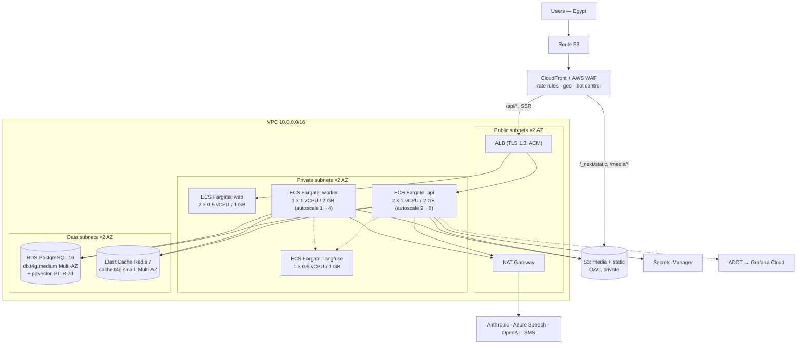

# 08 — Infrastructure & DevOps

> **Hosting is revised by [12 — Stack Revision](12-stack-revision-groq-selfhosted-voice.md):** static tier moves to Cloudflare Pages + R2, the API tier defaults to Hetzner + Coolify, and a scale-to-zero GPU is added for ASR. The AWS topology below remains the documented scale-up path and is still accurate.


## 1. Repository layout

```
misk/
├── apps/
│   ├── web/                  Next.js 15 — /app, /play, /console (one deployable, 3 route groups)
│   └── web-e2e/              Playwright
├── services/
│   └── api/
│       ├── app/
│       │   ├── main.py
│       │   ├── core/         config, db, redis, logging, otel, errors
│       │   ├── ai/           gateway.py, config.py, redaction.py, budget.py, prompts/
│       │   ├── guardrails/   chain.py, layers/, tests/redteam/
│       │   ├── modules/      identity, children, assessment, assessment_ai,
│       │   │                 content, learning, tutor_ai, voice, progress,
│       │   │                 notifications, console
│       │   └── workers/      arq tasks
│       ├── migrations/       alembic
│       ├── seeds/            curriculum.yaml, item_bank.yaml, consents.yaml
│       └── tests/            unit / integration / contract / evals
├── packages/
│   ├── api-client/           generated from openapi.json — do not hand-edit
│   ├── ui/                   shared components + tokens
│   └── config/               eslint, tsconfig, tailwind preset
├── infra/
│   ├── terraform/            envs/{staging,production}, modules/
│   └── docker/
├── evals/                    golden datasets + runner
└── docs/                     this folder
```

One Next.js app serves all three frontends as route groups with different layouts and auth. They share tokens and components; splitting them into three deployables at this scale would triple the CI time for no benefit.

## 2. AWS topology (`me-south-1`, Bahrain)



**Monthly cost estimate at 2,500 children:** ECS ~$150, RDS Multi-AZ ~$130, ElastiCache ~$45, ALB ~$25, NAT ~$40, S3 + CloudFront ~$35, Secrets/logs/misc ~$40, Langfuse ~$15. **≈ $480/month.**

### Budget alternative
Hetzner CX32 ×2 + managed Postgres + Cloudflare R2 + Cloudflare CDN, orchestrated with Coolify: **≈ $95/month**, with Frankfurt latency to Cairo of roughly 60–80 ms versus 25–35 ms from Bahrain. For a pilot this is a reasonable trade; move to AWS when the pilot converts. The Terraform is structured so the application layer is identical either way — only `infra/` changes.

## 3. Containers

```dockerfile
# services/api/Dockerfile
FROM python:3.12-slim AS base
ENV PYTHONDONTWRITEBYTECODE=1 PYTHONUNBUFFERED=1 UV_COMPILE_BYTECODE=1
RUN apt-get update && apt-get install -y --no-install-recommends \
      ffmpeg libpq5 curl && rm -rf /var/lib/apt/lists/*
COPY --from=ghcr.io/astral-sh/uv:latest /uv /usr/local/bin/uv

FROM base AS deps
WORKDIR /app
COPY pyproject.toml uv.lock ./
RUN uv sync --frozen --no-dev

FROM base AS runtime
WORKDIR /app
COPY --from=deps /app/.venv /app/.venv
ENV PATH="/app/.venv/bin:$PATH"
COPY app ./app
COPY migrations ./migrations
COPY seeds ./seeds
RUN useradd -u 10001 -m appuser && chown -R appuser /app
USER appuser
HEALTHCHECK --interval=30s --timeout=3s --start-period=20s \
  CMD curl -fsS http://localhost:8000/health || exit 1
CMD ["uvicorn","app.main:app","--host","0.0.0.0","--port","8000","--workers","2"]
```

`ffmpeg` is present for audio transcoding of uploads. The image runs as a non-root user, has no shell tooling beyond curl, and is scanned by Trivy in CI with a hard fail on HIGH/CRITICAL.

## 4. CI/CD (GitHub Actions)

```yaml
# .github/workflows/ci.yml  (structure)
jobs:
  lint:        ruff · mypy --strict · eslint · stylelint(no-physical-properties) ·
               banned-terms-lint · gitleaks
  test-api:    pytest -m "not live_ai" --cov --cov-fail-under=85
               + branch coverage gate 100% on app/modules/*/domain and app/guardrails
  test-web:    vitest · Storybook a11y (LTR + RTL)
  contract:    generate openapi.json → schemathesis run → diff packages/api-client
  e2e:         Playwright vs docker-compose stack (LLM stubbed) · axe-core all routes
  perf:        Lighthouse CI with hard budgets from docs/06
  security:    trivy image · pip-audit · pnpm audit
  evals:       only on prompt/ or ai/ changes → Batch API run → post diff table to PR
  guards:      route-authorisation check · single-anthropic-client check ·
               prompt-cache-hit assertion · required-guardrail-layer check
```

The four `guards` checks are cheap, project-specific, and each prevents a class of bug that normal testing misses:

1. **route-authorisation** — every child-scoped route declares `require_child_access`.
2. **single-anthropic-client** — no `anthropic.*Anthropic(` outside `app/ai/gateway.py`.
3. **prompt-cache-hit** — a recorded double call asserts `cache_read_input_tokens > 0`.
4. **required-guardrail-layer** — every decision point producing prose has `ClinicalSafetyLayer`, and every one selecting from a set has `CandidateSetLayer`.

**Deploy:** merge to `main` → build + push to ECR → Alembic migration as a one-off ECS task (forward-only, additive; a destructive migration requires a labelled PR and a manual approval) → ECS blue/green via CodeDeploy with a 10-minute bake, automatic rollback on 5xx rate or p95 latency alarms.

## 5. Observability

| Signal | Tool | Key items |
|---|---|---|
| Traces | OpenTelemetry → Grafana Tempo | Every request; span attributes `child_id_hash`, `decision_point`, never raw PII |
| Metrics | Prometheus → Grafana | RED per endpoint; queue depth; BKT update rate; cache hit rate |
| Logs | structlog JSON → CloudWatch → Grafana Loki | Field allow-list; no free-form interpolation of user data |
| LLM | Langfuse | Every generation with prompt version, tokens, cost, guardrail outcomes, deterministic comparison value |
| Errors | Sentry (self-hosted or EU) | PII scrubbing on; source maps uploaded |
| Uptime | Grafana Synthetic | `/health/ready` every minute from Cairo |

### Dashboards

1. **Product health** — daily active children, sessions, completion rate, assessments started/completed, mean session length.
2. **AI health** — per decision point: call volume, p95 latency, schema error rate, guardrail rejection rate, refusal rate, cache read ratio, cost.
3. **Learning quality** — mastery events per week, withhold rate, lapse rate, prompt-level distribution (a rising `full_model` share means content is too hard).
4. **Safety** — escalations by category, SLA compliance, L5 blocks, red-flag recall from the eval baseline.
5. **Cost** — per-child per-day, budget breaches, provider split.

### Alerts that page

| Alert | Threshold |
|---|---|
| 5xx rate | > 1% over 5 min |
| p95 latency, any endpoint | > 2× budget over 10 min |
| L5 safety block | any occurrence |
| Escalation severity 1 | immediately |
| Guardrail rejection rate | > 0.5% / 24 h per decision point |
| Cache read ratio | < 60% over 1 h |
| Cost per child per day | > $0.40 |
| Queue depth | > 500 for 10 min |
| DB connections | > 80% of max |
| Failed Alembic migration | immediately |

## 6. Local development

```bash
git clone … && cd misk
cp .env.example .env                 # AI_LIVE=0 by default — fixtures, no network
docker compose up -d                 # postgres, redis, minio, langfuse, mailhog
just bootstrap                       # uv sync, pnpm install, alembic upgrade, seed
just dev                             # api :8000, web :3000, worker
just test                            # everything except live AI
just eval interpret                  # requires ANTHROPIC_API_KEY
```

`seeds/` loads: 3 synthetic children at different ages and profiles, the 88-skill curriculum, the 120-item synthetic assessment bank, and a `.wav`-free TTS stub so no cloud credentials are needed for day-one development. **A new engineer should be running a full simulated play session within 15 minutes of cloning.** That is a design goal for the repo, and it is testable.

## 7. Runbooks

| Situation | Action |
|---|---|
| Anthropic outage | Flags auto-trip via the circuit breaker after 10 consecutive failures; verify the degraded banner appears; no manual action required |
| Azure Speech outage | Verify TTS cache hit rate holds; expressive tasks auto-switch to caregiver confirmation |
| Cost spike | `/console/cost` → find the child or decision point → tighten the budget or trip the flag → open an incident |
| Bad prompt shipped | Revert the Langfuse label to the previous version (no deploy); confirm with an eval run |
| Scoring bug found | Follow the scoring-correctness runbook in [07](07-security-privacy.md) §6 — freeze, re-score from `assessment_responses`, regenerate, notify |
| DB restore | PITR to the chosen second; run the consistency check script; replay the ARQ dead-letter queue |
| Escalation SLA breach | Ops pages the on-call clinician; if unreachable, the caregiver receives a human-written apology plus a signposting message |

## 8. Backup & DR

- RDS automated backups, 7-day PITR, plus a nightly logical dump to a separate account's S3 with Object Lock.
- S3 media versioned with cross-region replication to `eu-central-1`.
- **RPO ≤ 5 minutes, RTO ≤ 1 hour**, rehearsed quarterly with a real restore into a scratch environment.
- Terraform state in S3 with DynamoDB locking; the whole environment is reproducible from `terraform apply` plus a database restore.
