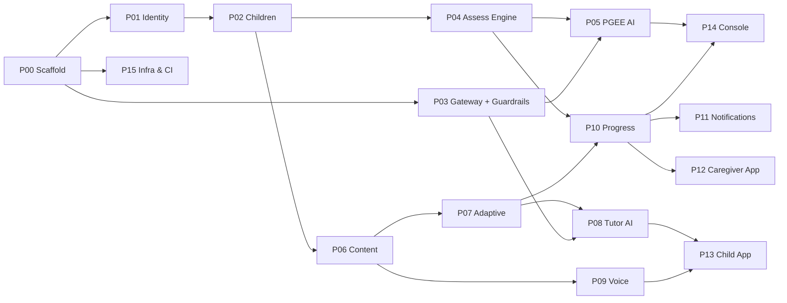

# 09 — Build Prompts

One self-contained prompt per component. Each is designed to be pasted into a **fresh** coding-agent session (Claude Code, Cursor, or a human with a checklist) that has this `docs/` folder available. Each builds a component that is **independently runnable and independently testable** — integration comes later, in [11](11-integration-roadmap.md).

## How to use these

1. Work in the dependency order below. Do not skip ahead — later prompts assume earlier interfaces exist.
2. Paste the **Shared Context Block** first, then the component prompt.
3. Run the matching test prompt from [10](10-test-prompts.md) before moving on. A component is not done until its tests are green and its Definition of Done is satisfied.
4. Each prompt ends with a mandatory `docs/adr/NNN-*.md` entry recording any decision the prompt left open. That is how the design stays truthful as the code diverges from it.

**Dependency order**



---

## Shared Context Block

> Paste this at the top of every component prompt.

```
PROJECT: سند (Sanad) — an Arabic-first (Egyptian dialect) e-learning and
developmental-tracking platform for children with Down syndrome and their caregivers.

Full design documents are in ./docs. Read these before writing code:
  docs/00-assumptions.md   — what was assumed and why
  docs/01-hld.md           — architecture principles and flows
  docs/02-data-model.md    — the schema you must conform to
  docs/03-ai-architecture.md — how AI is allowed to be used

NON-NEGOTIABLE PRINCIPLES:
1. Deterministic core, AI at bounded decision points. Every user-visible number is
   computed by tested code. The LLM only interprets, ranks, narrates, and flags.
2. The AI may be more conservative, never less. It can withhold a mastery verdict;
   it can never grant one beyond the deterministic rule.
3. Closed sets everywhere. An AI-chosen id must be a member of a candidate set the
   engine produced. Out-of-set means discard and use the engine's choice.
4. Every AI failure has a silent deterministic fallback. Users never see an error
   caused by AI unavailability.
5. The child is never blocked. No timers, no failure states, no ASR gate.
6. Nothing identifying crosses the LLM boundary. Names become {{CHILD}}/{{CAREGIVER}};
   ages are rounded to whole months; no DOB, phone, email, address, or audio.
7. Arabic-first. RTL is the default. CSS logical properties only. Egyptian colloquial
   for user-facing copy.

STACK:
  Backend  Python 3.12, FastAPI, SQLAlchemy 2.0 async, Alembic, Pydantic v2, ARQ,
           PostgreSQL 16 + pgvector, Redis 7, uv for dependencies
  AI       Anthropic Python SDK, model id exactly "claude-opus-5", LangGraph
  Frontend Next.js 15 App Router, TypeScript strict, Tailwind, shadcn/ui, next-intl
  Testing  pytest + pytest-asyncio + Hypothesis, Vitest, Playwright, schemathesis

ANTHROPIC API RULES (verified — do not substitute remembered patterns):
  - model id is exactly "claude-opus-5"
  - pass thinking={"type": "adaptive"}
  - DO NOT pass temperature, top_p, top_k, or budget_tokens — they return HTTP 400
  - DO NOT use assistant-message prefill — it returns HTTP 400
  - structured output: output_config={"format": {"type": "json_schema",
    "schema": Model.model_json_schema()}} with Pydantic ConfigDict(extra="forbid")
  - effort tier: output_config={"effort": "low"|"medium"|"high"}
  - prompt caching: cache_control {"type": "ephemeral"} on the last stable block
  - always check response.stop_reason == "refusal" before reading content
  - use client.beta.messages.create with betas=["server-side-fallback-2026-07-01"]
    and fallbacks="default" so a refusal routes instead of failing the turn

CODE STANDARDS:
  - ruff + mypy --strict must pass; no `# type: ignore` without a reason comment
  - business rules live in service.py; SQL lives in repository.py; pure logic lives
    in domain.py, which may not import anything from the project except other
    domain.py modules
  - every error returns RFC 9457 Problem Details including a `message_ar` field that
    is always safe to show a caregiver
  - no print(); structlog with a field allow-list; never interpolate user data into
    a log message
  - conventional commits; every PR updates docs/adr/ if it makes a decision
```

---

## P00 — Repository scaffold & shared foundations

```
TASK
Create the monorepo skeleton and the shared foundations every other component
depends on. No business logic.

BUILD
1. Monorepo: pnpm workspaces + Turborepo. Layout exactly as docs/08-infrastructure.md §1.
2. services/api: FastAPI app with
   - app/core/config.py    — pydantic-settings, all config from env, typed, no defaults
                             for secrets, fails loudly at startup if a required var is missing
   - app/core/db.py        — async engine, session factory, a get_session dependency
   - app/core/redis.py
   - app/core/errors.py    — a ProblemDetail exception hierarchy + a FastAPI handler
                             producing RFC 9457 with `code` and `message_ar`
   - app/core/logging.py   — structlog JSON, request id, a field allow-list
   - app/core/otel.py      — OpenTelemetry FastAPI + SQLAlchemy instrumentation
   - app/main.py           — app factory, /health, /health/ready, CORS, security headers
3. Alembic configured for async, with the enum types from docs/02 §2 as migration 0001.
4. docker-compose.yml: postgres 16 (with pgvector), redis 7, minio, mailhog.
5. justfile: bootstrap, dev, test, lint, migrate, seed, eval.
6. apps/web: Next.js 15, TS strict, Tailwind with the token set from docs/06 §2,
   next-intl configured for ar-EG with dir=rtl, IBM Plex Sans Arabic self-hosted and
   subset, three route groups (app)/(play)/(console) with placeholder pages.
7. packages/config: shared eslint, tsconfig, tailwind preset, and a stylelint config
   that BANS physical CSS properties (margin-left, padding-right, left, right, float).
8. GitHub Actions CI with the job structure from docs/08 §4. The four custom guard
   checks may be stubs that always pass for now, but the files must exist with a TODO.

ACCEPTANCE CRITERIA
- `just bootstrap && just dev` brings up api on :8000 and web on :3000 from a clean clone
- GET /health returns 200 with no database dependency
- GET /health/ready reports the status of db, redis and s3 individually
- An unhandled exception returns a valid RFC 9457 body with message_ar, never a stack trace
- `just lint` passes: ruff, mypy --strict, eslint, stylelint
- The stylelint rule demonstrably fails on a file containing `margin-left: 4px`
- A missing required env var causes a clear startup failure naming the variable
- The web app renders RTL with Arabic text at 17px/1.9 and no layout shift

DELIVERABLES
Working scaffold, README with a 15-minute onboarding path, docs/adr/001-stack.md
```

---

## P01 — C01 Identity & Access

```
CONTEXT: docs/04a-components-platform.md §C01, docs/05-api-contracts.md §2,
         docs/02-data-model.md §3

TASK
Build phone-OTP + email authentication, JWT issuance with refresh rotation, the
child-access authorisation dependency, and the play PIN.

BUILD
- Migration for caregivers, auth_otp, refresh_tokens, caregiver_child (exact DDL from docs/02)
- app/modules/identity/{router,service,repository,schemas,domain}.py
- OTP: 6 digits, 5-minute TTL, max 3 verify attempts, stored as sha256(code||pepper),
  constant-time comparison, never logged
- Rate limits (Redis sliding window): 3 requests per phone per hour, 10 per IP per hour,
  10 verify attempts per IP per hour
- Enumeration resistance: /auth/otp/request always returns 202 with a jittered 80–140ms
  delay on the no-send path
- JWT RS256, access 15 min with claims {sub, cgid, jti, scope}, 60s nbf leeway
- Refresh tokens: opaque, 30-day, hashed at rest, httpOnly+Secure+SameSite=Lax cookie,
  rotated on every use, with a family_id. Presenting an already-consumed token MUST
  revoke the entire family and force re-auth
- SmsProvider protocol with TwilioSms, LocalAggregatorSms and NullSms (test) adapters
- `require_child_access(child_id, min_role)` FastAPI dependency resolving caregiver_child
- Play PIN: argon2id, 5 attempts then a 15-minute lockout, account auth as the escape hatch

ACCEPTANCE CRITERIA
- Full OTP register → login → refresh → logout cycle works
- 100 sequential wrong OTP codes never succeed and lock after 3
- Reusing a consumed refresh token revokes the family; the old access token still works
  until expiry but no new one can be minted
- require_child_access returns 403 for an unlinked child and 200 for a linked one
- No secret, OTP code, token, or hash appears in logs at DEBUG level (assert by capturing
  log output during the full auth flow and grepping)
- /auth/otp/request has statistically indistinguishable latency for existing and
  non-existing numbers (assert mean difference < 20ms over 50 calls each)
- schemathesis passes against the generated OpenAPI for all /auth and /me routes

DELIVERABLES
Module + tests + OpenAPI + docs/adr/002-auth.md
```

---

## P02 — C02 Child Profile & Consent

```
CONTEXT: docs/04a-components-platform.md §C02, docs/05 §3, docs/02 §3, docs/07 §4

TASK
Build the child record, the accessibility profile, the versioned consent ledger, the
ConsentGate, co-caregiver invites, and export/erasure jobs.

BUILD
- Migration for children, consent_definitions, consents; seed the 7 consent keys
  from docs/02 §3 with Arabic and English wording and is_mandatory flags
- Child CRUD with the accessibility profile fields and their CHECK constraints
- age_months() with corrected-age logic for gestational_weeks < 37 before 24 months
  chronological — put this in domain.py as a pure function
- ConsentGate dependency: raises CONSENT_REQUIRED (403) when a required consent is
  absent. Reads through a 60-second Redis cache that is explicitly invalidated on write
- Consent grant/withdraw is append-only; withdrawal takes effect within the same request
- Withdrawing voice_retention enqueues an S3 prefix purge job (5-minute SLA)
- Co-caregiver invite: signed token, 7-day expiry, single use, role on the link
- Optimistic concurrency on PATCH via If-Unmodified-Since → 409 with a field-level diff
- ARQ jobs: export_child_data (JSON+CSV zip → pre-signed URL, 24h TTL) and
  erase_child (hard delete + cascade + S3 purge + pgvector purge + audit tombstone
  + rollup anonymisation)

ACCEPTANCE CRITERIA
- Creating a child without all three mandatory consents fails with 422 and a clear message_ar
- Corrected age: a child born at 32 weeks, now 18 months chronological, returns
  16.85 corrected (±0.05); at 26 months chronological, corrected == chronological
- Withdrawing ai_processing causes the next gated call to raise CONSENT_REQUIRED within
  the same request — no stale cache window
- Two concurrent PATCHes: the second gets 409, not a lost update
- Export contains every table row referencing the child; a reviewer can verify completeness
  against a checklist test
- Erasure leaves zero rows in any child-referencing table; verified by a query that walks
  every foreign key to children
- Property test: age_months is monotonically non-decreasing in `today` for any dob

DELIVERABLES
Module + tests + jobs + docs/adr/003-consent-model.md
```

---

## P03 — C15 LLM Gateway + C11 Guardrails

```
CONTEXT: docs/03-ai-architecture.md (entire), docs/04e §C11

TASK
Build the single choke point for all LLM calls and the seven-layer guardrail chain.
This component ships BEFORE anything that uses AI, and it ships with no callers.

BUILD
1. app/ai/redaction.py — Pseudonymiser: reversible {{CHILD}}/{{CAREGIVER}} substitution,
   regex strip of phone/email/national-ID patterns, age rounding to whole months,
   removal of governorate. Must handle Arabic text correctly (no mangling of
   combining marks). Provide scrub() and rehydrate().
2. app/ai/budget.py — BudgetGuard over cost_ledger: soft $0.40/child/day (warn),
   hard $0.60 (raise BudgetExceeded). Atomic increment.
3. app/ai/gateway.py — call_structured() exactly as specified in docs/03 §3.3.
   Prompt layout must be cache-optimal: frozen system blocks with cache_control,
   frozen few-shot block with cache_control, then semi-stable, then volatile.
   All JSON serialised with sort_keys=True, ensure_ascii=False.
   Persist an ai_calls row with token counts and computed cost on EVERY outcome
   including failures.
4. app/ai/prompts/ — a PromptStore that loads from Langfuse by label with a
   baked-in local fallback copy, so a Langfuse outage cannot break the product.
5. app/guardrails/ — GuardrailChain plus layers: SchemaLayer, CandidateSetLayer,
   VerdictEnumLayer, ProbeAllowlistLayer, NumericFidelityLayer (normalising both
   Western and Eastern Arabic numerals), ClinicalSafetyLayer (keyword pre-filter +
   DP0 classifier, FAILS CLOSED on classifier error), ConservatismLayer,
   ReadingLevelLayer, PiiLeakLayer, RedFlagLayer.
   Every rejection writes a guardrail_events row.
6. app/guardrails/escalation.py — create escalation, set SLA by severity
   (sev1 2h, sev2 24h, sev3 72h), return the FIXED human-written Arabic template for
   the category. Templates are module constants and are never model-generated.
7. Feature flags: a Redis-backed store with a 30-second TTL, keys
   ai.pgee.next_item, ai.pgee.interpret, ai.pgee.report, ai.tutor.plan,
   ai.tutor.judge, ai.tutor.summary, ai.voice.asr.
8. A recorded-fixture test harness: a pytest fixture that replays saved Anthropic
   responses so every downstream component can be tested with zero network calls.

ACCEPTANCE CRITERIA
- With AI_LIVE=0, call_structured returns fixture responses and makes no network call
- Pseudonymiser round-trips Arabic names containing tashkeel, hamza forms and ta marbuta
- A prompt containing a child name anywhere fails a test that asserts the outgoing
  payload contains no value from the children table
- CandidateSetLayer rejects an out-of-set id and the caller receives a clean fallback
- NumericFidelityLayer catches "٣ سنين" when the engine computed 2.5, and catches the
  Western-digit equivalent
- ClinicalSafetyLayer blocks all 60 red-team cases in app/guardrails/tests/redteam/
- ConservatismLayer clamps confirm→withhold when deterministic says withhold, and
  logs a monotonicity guardrail event
- A second identical call reports usage.cache_read_input_tokens > 0 (live test, run
  manually with a real key; assert in CI against a recorded usage fixture)
- BudgetExceeded is raised at the hard limit and the ai_calls row records the outcome
- A CI check fails the build if anthropic.Anthropic or AsyncAnthropic is constructed
  outside app/ai/gateway.py — implement this check

DELIVERABLES
Module + red-team suite + fixture harness + the CI guard scripts +
docs/adr/004-llm-gateway.md, docs/adr/005-guardrails.md
```

---

## P04 — C03 Assessment Engine (deterministic)

```
CONTEXT: docs/04b-components-pgee.md §C03, docs/02 §4

TASK
Build the PGEE engine: item bank, basal/ceiling administration, evidence propagation,
DA/DQ scoring. ZERO AI. The domain/ package must have no I/O at all.

BUILD
- Migration for assessment_domains, assessment_bands, assessment_items,
  assessment_rules, assessments, assessment_responses, assessment_domain_scores,
  assessment_reports
- Seed seeds/item_bank.yaml — 120 synthetic items, 20 per domain, spread across
  bands 0–5, each with prompt_ar (Egyptian), prompt_ar_msa, example_ar, criterion_ar,
  observable_cue, 2–3 probe templates, implies_pass edges, linked_skills.
  Every item watermarked bank_version="synthetic-v1" and the seed file carries a
  header comment: NOT FOR CLINICAL USE.
- app/modules/assessment/domain/: bands.py, basal_ceiling.py, scoring.py,
  propagation.py, state.py — implement exactly the algorithms in docs/04b §C03
- service.py: open_session, next_candidates, record_response (transactional, with
  propagation), correct_response (append-only supersede + full replay), finalise
- router.py: POST /assessments, GET /assessments/{id}, POST answers, POST corrections,
  POST finalise. Enforce the 150-day gate with a 409 ASSESSMENT_TOO_SOON carrying
  next_eligible_at
- Handle: not_applicable (excluded from runs and denominator), skipped (breaks a run
  without contributing), bank floor reached without a basal, child age out of range
  (clamp + out_of_range flag that suppresses DQ), CA = 0 (suppress DQ, keep DA)

ACCEPTANCE CRITERIA
- 100% BRANCH coverage on app/modules/assessment/domain/ — this is a hard gate
- Hypothesis property tests:
  * replaying any legal answer sequence produces identical scores regardless of the
    order in which domains were interleaved
  * DA is monotonically non-decreasing in the number of `yes` answers
  * DQ is never negative; DQ > 200 sets a warning flag rather than being returned raw
  * correcting an answer and replaying equals administering the corrected sequence
    from scratch
- Golden tests: 6 hand-computed scenarios (one per domain) where a clinician-style
  hand calculation of DA and DQ matches the engine to 2 decimal places. Put the hand
  calculations in the test file as comments.
- Evidence propagation on a `yes` reduces the remaining item count and never affects
  basal or ceiling detection
- A full assessment of a synthetic 42-month child completes in < 200ms of engine time
  and administers between 20 and 40 items

DELIVERABLES
Module + seed bank + tests + docs/adr/006-scoring-rules.md recording the exact
basal/ceiling/credit constants used and where they must be verified against a
licensed manual
```

---

## P05 — C04 PGEE AI Orchestrator

```
CONTEXT: docs/04b §C04, docs/03 §5 and §7.1–7.4, docs/05 §4
DEPENDS ON: P03 (gateway + guardrails), P04 (engine)

TASK
Wrap the assessment engine in a LangGraph session with AI interpretation, probing,
item ranking and report authoring — all with deterministic fallbacks.

BUILD
- app/modules/assessment_ai/graph.py — the graph exactly as docs/04b §C04, compiled
  with AsyncPostgresSaver checkpointing into assessments.graph_checkpoint and
  interrupt_before=["classify","record"]
- Nodes: candidates, rank (DP2), present, classify (DP0), interpret (DP1), probe,
  record, escalate, finalise, report (DP4)
- Prompts: implement the four system prompts verbatim from docs/03 §7, register them
  in the PromptStore with labels pgee_interpret@v1, pgee_next_item@v1, pgee_report@v1
- Pydantic output models with ConfigDict(extra="forbid") for each decision point
- Few-shot block for DP1: 6 curated Egyptian-Arabic examples covering unambiguous yes,
  help-dependent→emerging, effort-without-success→emerging, off-criterion→unclear+probe,
  a red-flag answer, and a prompt-injection attempt scored as data
- SSE endpoint GET /assessments/{id}/stream emitting exactly the events in docs/05 §4.1,
  with Last-Event-ID replay from the checkpoint
- Probes are looked up by probe_id from the item's template list — NEVER generated
- Report generation as an ARQ job whose input to the model is ONLY engine-computed
  numbers (the exact object shape is in docs/04b §C04)
- Progress estimation as a range that can only narrow

FALLBACK BEHAVIOUR (test each explicitly)
- rank fails or returns out-of-set → engine's top candidate, session continues
- interpret fails → SSE `degraded` event, client shows the three tap buttons
- classify errors → treat as flagged, escalate, suppress AI narration
- report fails L4 or L5 twice → ship the template report with is_template=true and
  queue it for clinician review

ACCEPTANCE CRITERIA
- Full assessment runs end to end against recorded fixtures with no network
- Chaos test: with EVERY AI node forced to fail, a valid scored assessment with a
  template report is still produced
- Resume: checkpoint at item 31, restart the process, resume — same basal/ceiling
  state, same probe budget, same next item
- Probe budget of 2 per item is never exceeded
- The interpreted verdict is always presented as a confirmable chip; a caregiver
  correction supersedes it and triggers a replay
- Every value in the report narrative is present in the engine's number object
  (assert with NumericFidelityLayer over 20 generated reports)
- Evals: interpret_ar ≥ 95% exact match, interpret_adversarial 100%, next_item 100%
  in-set, report_safety 100% on L4+L5

DELIVERABLES
Module + prompts + SSE + eval datasets + docs/adr/007-pgee-orchestration.md
```

---

## P06 — C05 Content Service & curriculum

```
CONTEXT: docs/04c-components-learning.md §C05, docs/02 §5 and §10

TASK
Build the curriculum data, the activity generator, distractor selection, and the
session manifest assembler.

BUILD
- Migration for media_assets, skills, skill_prerequisites, activity_templates,
  activities, tts_cache
- seeds/curriculum.yaml — all 88 skills from docs/02 §10.1 with code, category,
  label_ar (unvowelised), label_vowelised (WITH tashkeel), label_egy,
  transliteration, phonemes, difficulty_tier, intro_order, and a hand-curated
  distractor_pool of at least 4 per skill.
  IMPORTANT: the Arabic content must be reviewed by a native Egyptian Arabic speaker
  before merge. Mark the file with a REVIEWED-BY header that CI checks is non-empty.
- 9 activity templates per docs/02 §10.2, each with instruction_ar (≤5 words after
  substitution), success_audio_pool, retry_audio_pool
- choose_distractors() exactly as docs/04c §C05, including the tier-based contrast
  rule and the no-repeat-in-last-3 rule
- Activity generator: template × skill → activity rows, idempotent, re-runnable
- Session manifest assembler producing the exact JSON shape in docs/04c §C05, with
  pre-signed CDN URLs and an expires_at
- Content publishing: draft → review → published, immutable versions, rollback by
  pointer, and a publish gate that fails if any referenced audio asset is missing

ACCEPTANCE CRITERIA
- All 88 skills seed cleanly; every one has a vowelised label, phonemes, alt text and
  ≥ 4 distractor candidates — assert with a data-quality test, not a manual check
- Tier-1 distractors are never from the same category as the target, and never a
  colour within 0.4 perceptual distance — assert over all colour skills
- A manifest for any child validates against the JSON schema and every URL returns 200
- Publishing with a missing audio asset is refused with a clear error naming the asset
- The generator is idempotent: running it twice produces zero new rows
- A test asserts every instruction_ar is ≤ 5 words after substitution for every skill

DELIVERABLES
Module + seeds + manifest schema + docs/adr/008-curriculum.md
```

---

## P07 — C06 Adaptive Learning Engine

```
CONTEXT: docs/04c §C06, docs/02 §6
DEPENDS ON: P06

TASK
Build BKT, forgetting, spaced repetition, the deterministic mastery rule, and
candidate generation. ZERO AI.

BUILD
- Migration for skill_states, mastery_events (INCLUDING the ai_cannot_grant CHECK
  constraint — this is load-bearing), play_sessions, attempts
- domain/bkt.py, domain/scheduling.py, domain/mastery.py, domain/candidates.py —
  implement exactly the algorithms in docs/04c §C06 with the stated parameters
  (p_L0 0.15, p_transit 0.25, p_slip 0.25, p_guess 1/n, prompt-level discounting)
- apply_decay nightly job with the half-life formula and the lapsed transition
- schedule() with the gentled SM-2 intervals [1,2,4,7,12,21,35]
- mastery_rule(): p_known ≥ 0.90 AND distinct_days ≥ 2 AND a delayed pass ≥ 3 days
  after the first correct AND independent_ratio ≥ 0.60
- candidates(): due reviews + lapsed + at most ONE new eligible skill + one mastered
  confidence item, capped at 8. No new skill at all when ≥ 3 skills are `practising`
- The prompt ladder contract: record which rung produced the response and discount
  BKT accordingly
- Idempotent attempt ingestion keyed on attempts.idempotency_key

ACCEPTANCE CRITERIA — the third one is the one that matters
- Property test: p_known stays strictly within (0,1) over 10,000 random attempt
  sequences with random choice counts and prompt levels
- A child answering everything correctly at `independent` reaches mastery in a bounded
  number of sessions (assert ≤ 6 sessions for a tier-1 skill)
- A RANDOM TAPPER NEVER REACHES MASTERY: simulate 500 attempts at each of 2, 3 and 4
  choices with uniformly random selection; assert mastery_state never becomes
  `mastered` for any skill. Run this in CI.
- Attempting to INSERT a mastery_event with to_state='mastered' and rule_satisfied=false
  raises a database error — assert by executing the raw SQL
- Replaying the same attempt with the same idempotency key twice produces one row and
  one BKT update
- Decay moves a mastered skill to `lapsed` after the modelled overdue period and back
  to the review queue at high priority
- candidates() never returns two new skills, and returns zero new skills when three
  are practising

DELIVERABLES
Module + simulation harness + tests + docs/adr/009-bkt-parameters.md recording the
parameter choices and the plan to fit them from real data later
```

---

## P08 — C07 Tutor Orchestrator

```
CONTEXT: docs/04c §C07, docs/03 §6 and §7.3
DEPENDS ON: P03, P06, P07

TASK
Build the play-session LangGraph: planning, engagement response, mastery judgement,
session summary — with deterministic fallbacks throughout.

BUILD
- app/modules/tutor_ai/graph.py — nodes candidates, plan (DP2), manifest, ingest,
  affect, rescue, judge (DP3), clamp (L6), commit, summary (DP4)
- Plan constraints enforced by a PlanConstraintsLayer: a permutation of a subset of
  the given ids only; open and close on a mastered skill; the single new skill in
  position 3–5; never two expressive in a row; never the same skill back to back.
  Violation → deterministic ordering.
- engagement() heuristic exactly as docs/04c §C07 — pure, no AI, instant
- Affect responses: struggling / tiring / flowing / steady per the table
- Hard limits that override everything: 10 minutes, 15 activities, or 3 consecutive
  no_response → end warmly
- Mastery judge: one batched call at session end over all touched skills, receiving
  the evidence bundle shape from docs/04c §C07. The bundle must NOT contain the
  child's name, age in years, or diagnosis.
- ConservatismLayer clamp, then commit mastery_events and skill_states transactionally
- Session summary: 4 lines of Egyptian Arabic + one home activity from a fixed
  household-object list; no numbers except the activity count
- Offline drain: POST /play/sessions/{id}/attempts/batch absorbing up to 100 attempts,
  deduplicated by idempotency key, then running judge/commit/summary

ACCEPTANCE CRITERIA
- A scripted simulated child runs 30 sessions end to end with AI stubbed and produces
  a monotonically sensible mastery curve
- The AI judge returning "confirm" when the deterministic rule is unmet results in
  NO mastery transition, a clamp guardrail event, and an alert metric increment
- With the tutor_plan flag off, sessions still run with deterministic ordering and
  no user-visible difference beyond ordering
- Killing the network mid-session and replaying the outbox loses zero attempts and
  creates zero duplicates
- 3 consecutive no_response always ends the session warmly, never mid-activity
- The evidence bundle sent to the model contains no name, no diagnosis and no age in
  years — assert by scanning the outgoing payload
- Evals: mastery_judge ≥ 90% correct withhold on artefacts, ≤ 5% false withhold

DELIVERABLES
Module + simulation harness + eval dataset + docs/adr/010-tutor-orchestration.md
```

---

## P09 — C08 Voice Gateway

```
CONTEXT: docs/04d-components-voice.md (entire)
DEPENDS ON: P06

TASK
Build TTS with permanent caching and pre-generation, ASR behind a provider interface,
and lenient pronunciation scoring with a caregiver override.

BUILD
- TtsProvider protocol + AzureTts (ar-EG-SalmaNeural / ar-EG-ShakirNeural),
  ElevenLabsTts, NullTts. SSML template exactly as docs/04d §2 including rate -15%,
  the 600ms trailing break, emphasis on the target word, and vowelised input text.
- Cache: sha256(voice|rate|pitch|ssml) → tts_cache → S3 → synthesise. Never evict.
  Async hit_count update off the read path.
- Pre-generation ARQ job over the full inventory (~850 utterances), idempotent,
  reporting missing assets as a publish blocker. Loudness-normalise to -16 LUFS.
- AsrProvider protocol + AzureAsr (ar-EG, with a phrase list containing the expected
  word and known child variants, n_best=5), OpenAiAsr fallback, NullAsr.
- normalize_ar(): strip tashkeel, unify أإآا, ة→ه, ى→ي, remove tatweel
- g2p(): Arabic grapheme-to-phoneme for the closed vocabulary of 88 skills
- phoneme_similarity(): normalised weighted Levenshtein with the substitution-cost
  matrix from docs/04d §3 (emphatic↔plain 0.2, fricative→stop 0.3, cluster reduction
  0.3, final consonant deletion 0.3, vowel length 0.15, other 1.0, indel 0.8)
- score_attempt(): accept ≥ 0.55, retry ≥ 0.30, otherwise unclear. ALWAYS accept on
  attempt ≥ 2 as accepted_on_effort.
- POST /voice/attempt, POST /voice/override, POST /voice/tts (admin), GET /voice/health
- Audio handling: ≤ 1MB, magic-byte sniffed, transcoded via ffmpeg, held in memory,
  deleted immediately after scoring unless voice_retention consent is present

ACCEPTANCE CRITERIA
- 60 hand-built (expected, heard) pairs covering every substitution class produce the
  expected verdicts. Put the linguistic rationale for each in the test file.
- Attempt 2 is ALWAYS accepted regardless of similarity — assert with a pure-noise input
- With ASR unavailable, expressive activities fall back to caregiver-confirmation mode
  and the session continues
- Without voice_asr consent, expressive activities never appear and the curriculum is
  still completable receptively
- Audio is deleted after scoring when voice_retention is absent — assert by checking
  the S3 bucket and the temp directory
- Pre-generation produces every inventory item; a missing asset blocks publish
- Loudness across the generated corpus is within ±1 LUFS
- No audio, transcript or embedding is ever passed to the LLM gateway — assert with a
  test that spies on gateway calls during a full voice attempt

DELIVERABLES
Module + scoring test corpus + pre-generation job + docs/adr/011-voice-scoring.md
recording the 0.55 threshold and the calibration plan against real child recordings
```

---

## P10 — C09 Progress & Analytics

```
CONTEXT: docs/04a §C09, docs/05 §5
DEPENDS ON: P04, P07

TASK
Build event ingestion, rollups, and the four caregiver-facing progress views.

BUILD
- Migration for events (monthly partitions with an automatic partition-creation job)
  and progress_rollups
- POST /events batch ingestion from the client outbox, idempotent
- Incremental rollup on session end + a full nightly rebuild that is the correctness
  backstop. Both must be idempotent upserts keyed on (child_id, period).
- GET /children/{id}/progress/today, /skills, /journey, /assessments
- All aggregation server-side; the client receives render-ready data

PRODUCT RULES (implement, do not treat as copy)
- No trend line is returned before 3 data points; return a `insufficient_data` marker
  and the copy key instead
- No percentile or age-comparison field on any dashboard endpoint. DQ appears only in
  the report payload
- Regression (skills_mastered down, or a domain DA down) returns a `revisit_plan` of
  exactly 3 activities alongside it — never a bare negative signal

ACCEPTANCE CRITERIA
- Nightly rebuild and incremental rollup produce identical numbers for a 30-session
  synthetic history — assert by running both and diffing
- Replaying the rollup job twice changes nothing
- No dashboard endpoint returns a percentile, a norm comparison, or a DQ field —
  assert by schema inspection over the whole OpenAPI spec
- The journey endpoint returns insufficient_data with fewer than 3 assessments
- Partition creation runs ahead of need; inserting an event for next month succeeds

DELIVERABLES
Module + jobs + tests + docs/adr/012-progress-presentation.md
```

---

## P11 — C10 Notifications & Scheduling

```
CONTEXT: docs/04a §C10
DEPENDS ON: P02, P10

TASK
Build scheduled jobs, notification delivery, and the anti-nagging controls.

BUILD
- Migration for notifications with the dedupe_key UNIQUE index
- ARQ cron jobs: pgee_due_scan, weekly_digest, streak_encourage, report_ready,
  escalation_sla, rollup_rebuild, bkt_decay, tts_pregen, cost_report
- Web Push (VAPID) + SMS + in-app channels behind one send path
- Anti-nagging, enforced centrally in the send path (not per job):
  * hard cap 3 notifications per caregiver per week across all kinds
  * quiet hours 21:00–08:00 Africa/Cairo — defer, never drop
  * pgee_due nudges at 180, 194, 208 days then STOP forever
  * one-tap "fewer reminders" setting a 1/week cap
- A banned-content check on every notification body using the copy lint list from
  docs/06 §3 — a notification implying the child is behind must be impossible to send

ACCEPTANCE CRITERIA
- A caregiver with 10 eligible notifications in a week receives exactly 3
- A notification scheduled at 22:00 Cairo is delivered at 08:00, not dropped
- pgee_due sends at most 3 times ever per assessment cycle
- Duplicate dedupe_key insertion is rejected by the database, not by application code
- The banned-terms check rejects a test notification containing "متأخر"
- Timezone handling is correct across a DST boundary (Egypt observes DST — test it)

DELIVERABLES
Module + jobs + tests + docs/adr/013-notification-policy.md
```

---

## P12 — C12 Caregiver Web App

```
CONTEXT: docs/04e §C12, docs/06 (entire), docs/05
DEPENDS ON: P01, P02, P05, P10

TASK
Build the caregiver PWA: onboarding, dashboard, the PGEE runner, and reports.

BUILD
- Route group (app) with the IA from docs/04e §C12
- Onboarding: phone → OTP → caregiver profile → child profile → consent (7 granular
  toggles, 3 mandatory) → first assessment CTA
- The PGEE runner: SSE consumption, one question per screen, the exact anatomy in
  docs/04e §C12 — narrowing progress range, question, concrete example, three big
  buttons, secondary free-text + mic, confirmable interpretation chip, propagated
  answers card, save-and-continue on every screen
- Report screen: strengths first, growth in the child's own terms, focus areas as
  next steps, DQ and norms behind a collapsed opt-in panel, 5 home activity cards
  with add-to-week, permanent not-a-medical-assessment footer
- Dashboard: Today, Skills map (88-skill grid), Journey (charts), Assessments
- Settings: the accessibility profile with plain-language questions, not jargon
- Account: profile, consents, co-caregivers, export, delete
- PWA: next-pwa, app shell precache, install prompt after the SECOND successful session

ACCEPTANCE CRITERIA
- axe-core clean at WCAG 2.2 AA on every route, in CI
- Full keyboard navigation with a visible ≥3px focus ring
- No physical CSS property anywhere — stylelint enforces it
- RTL correct including mirrored directional icons and Eastern Arabic numerals
- The progress range NEVER widens during a session — assert with a Playwright test
  that records every progress value and checks monotonic narrowing
- Every interpreted verdict is confirmable and correctable in one tap
- Lighthouse budgets from docs/06 §6 pass as hard CI thresholds
- The banned-terms lint passes over every string in the i18n bundle
- Every string reviewed by a native Egyptian Arabic speaker — CI checks a REVIEWED-BY
  header in the locale file
- Works offline for read views; writes queue and retry

DELIVERABLES
App + Storybook (LTR and RTL stories for every component) + Playwright suite +
docs/adr/014-caregiver-ux.md
```

---

## P13 — C13 Child Play App

```
CONTEXT: docs/04e §C13, docs/06 §4, docs/04c, docs/04d
DEPENDS ON: P06, P08, P09

TASK
Build the child's play experience. This is the component where the accessibility
requirements ARE the functional requirements.

BUILD
- Route group (play), full-screen, no chrome, PIN-gated exit
- Preload EVERY manifest asset into the Cache API before the first prompt, behind a
  friendly loading character
- Zustand store + IndexedDB outbox: write the attempt locally with an idempotency key
  first, then POST. Drain on `online`. Background Sync where available.
- Activity renderers: listen_point, match_pair, say_it, sort_category, story_moment
- The prompt ladder with the exact timings in docs/06 §4:
  t=0 prompt · t=+wait identical repeat + 1.5Hz pulse on the correct choice ·
  t=+2×wait partial verbal · t=+3×wait full model + highlight + auto-select after 1.5s
- MicButton with Silero VAD (WASM) tuned per docs/04d §3: threshold 0.35,
  min speech frames 2, pre-speech pad 500ms, redemption 24 frames (~750ms), max 6s
- CaregiverOverrideButton ("قالها صح ✅") permanently visible on expressive activities
- NourCharacter with exactly 4 states: idle, speaking, listening, celebrating
- Wake lock, audio unlock on the caregiver's start tap, double-tap tolerance 400ms,
  long-press counts as a tap on release
- calm_mode: desaturated palette, no sfx, no confetti, 1200ms inter-activity pause
- Session end: closing scene, then hand back to the caregiver summary

HARD REQUIREMENTS (each gets its own test)
- Touch targets ≥ 88×88px with ≥20px gaps at a 320px viewport
- Contrast ≥ 7:1 on every screen
- No animation above 3Hz, none longer than 400ms, prefers-reduced-motion honoured
- No visible timer anywhere
- No failure state reachable by any input sequence
- Instructions ≤ 5 words
- 800ms of calm between activities

ACCEPTANCE CRITERIA
- A full session completes with the network disabled after manifest load
- A 30-second dropout mid-session loses zero attempts and creates zero duplicates
- Playwright asserts every touch target's bounding box at 320px width
- A frame-analysis test asserts no animation exceeds 3Hz
- Fuzzing the input (random taps, double taps, long presses, rapid mic toggling) never
  reaches an error state or a dead end
- The prompt ladder always terminates in a success within 4 rungs
- Audio plays on iOS Safari after the caregiver's start tap (test on a real device)

DELIVERABLES
App + Playwright suite + a device-test report covering one low-end Android and one
iOS device + docs/adr/015-child-interaction.md
```

---

## P14 — C14 Clinician / Admin Console

```
CONTEXT: docs/04e §C14, docs/05 §7
DEPENDS ON: P03, P05, P10

TASK
Build the internal console: escalation queue, item bank and content editors, report
review, AI observability, flags, cost.

BUILD
- Route group (console), separate auth realm, mandatory TOTP MFA, IP allow-list,
  30-minute idle timeout
- Roles: clinician, content_editor, ops, admin — least privilege, child data visible
  only to clinician and admin
- Every access to an identified child record requires a typed reason and writes an
  audit_log row
- Escalation queue sorted by SLA with acknowledge / respond / resolve / dismiss
- Item bank editor including implies_pass edges, probe templates and observable_cue,
  with draft → clinical review → publish and a named reviewer on every change
- Content editor for skills, templates, distractor pools, media and alt text, with the
  TTS pre-generation publish gate
- Report review queue for is_template=true and L5-blocked reports, with edit and release
- AI observability: ai_calls and guardrail_events explorer with a Langfuse deep link
- Feature flag panel with per-cohort rollout, audit-logged, effective within 30s
- Cost dashboard: per child, per day, per decision point, with budget breaches

ACCEPTANCE CRITERIA
- No route reachable without MFA — assert for every route
- A content_editor session cannot reach any child data — assert by walking every route
  with each role and checking for 403
- Every child-data access writes an audit row containing the stated reason
- Toggling a flag takes effect in the API within 30 seconds without a deploy
- Publishing an item bank with an unreviewed item is refused
- audit_log rejects UPDATE and DELETE — assert with raw SQL

DELIVERABLES
Console + tests + docs/adr/016-console-access.md
```

---

## P15 — Infrastructure, CI & observability

```
CONTEXT: docs/08-infrastructure.md (entire)
DEPENDS ON: P00 (can run in parallel with everything else)

TASK
Terraform the AWS environment, complete the CI pipeline including the four custom
guard checks, and wire observability end to end.

BUILD
- infra/terraform/modules: network, ecs, rds, redis, s3-cloudfront, secrets, waf,
  observability; envs/staging and envs/production
- Production Dockerfiles per docs/08 §3: multi-stage, non-root, healthcheck, Trivy-clean
- GitHub Actions with the full job matrix from docs/08 §4, including:
  * route-authorisation check — every child-scoped route declares require_child_access
  * single-anthropic-client check — no client construction outside app/ai/gateway.py
  * prompt-cache-hit assertion
  * required-guardrail-layer check
  * banned-terms lint over all i18n bundles
  * Lighthouse CI with hard budgets
- Blue/green deploy via CodeDeploy with a 10-minute bake and automatic rollback on
  5xx rate or p95 latency alarms
- Alembic migrations as a pre-deploy one-off ECS task; forward-only and additive;
  a destructive migration requires a labelled PR and manual approval
- OpenTelemetry → Grafana Cloud; Langfuse deployed; the five dashboards and all
  paging alerts from docs/08 §5
- Backup: RDS PITR 7 days + nightly logical dump to a separate account with Object Lock;
  S3 versioning + cross-region replication

ACCEPTANCE CRITERIA
- `terraform apply` from zero produces a working staging environment
- A deliberately broken deploy rolls back automatically within the bake window
- Each of the four guard checks demonstrably FAILS when its violation is introduced —
  write those failing cases as CI fixtures, do not just assert the happy path
- RPO ≤ 5 min and RTO ≤ 1 h verified by an actual restore drill into a scratch env
- Every kill switch exercised in staging under simulated load
- No secret in git history — gitleaks clean over the full history

DELIVERABLES
Terraform + CI + dashboards + runbooks + docs/adr/017-infrastructure.md
```
