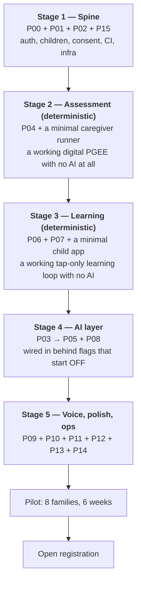

# 11 — Integration Plan & Roadmap

## 1. Wiring order

Components are built and tested in isolation ([09](09-build-prompts.md), [10](10-test-prompts.md)). Integration happens in five gated stages. Each stage has an exit gate; you do not proceed until it passes.

**The ordering principle: the product must be complete and shippable before any AI is switched on.** Stages 2 and 3 produce a real, usable product — a digital PGEE and a tap-based Arabic learning app. Stage 4 adds AI on top of something that already works, behind flags that default to off. That is what makes the "every AI failure has a deterministic fallback" principle true in practice rather than only in design: the fallback path was the product for three stages, and it is exercised continuously.

### Stage gates

| Stage | Exit gate |
|---|---|
| 1 | A caregiver can register, create a child, grant consent, and be authorised. CI green with all four guard checks live. Staging deployed from Terraform. Erasure and export verified. |
| 2 | A clinician can run a complete assessment through the UI and agrees the scores are correct on 6 hand-checked cases. No AI code has been written yet. |
| 3 | A child can complete a 10-activity tap-only session; a skill reaches `mastered` legitimately; the random tapper never does. No AI code has been written yet. |
| 4 | Every AI decision point can be independently switched off with **no user-visible error**, verified in staging under load. All eval suites green. Red team 100%. |
| 5 | All 12 integration journeys green. Load test at 3× peak within budget. Accessibility review signed off by an OT. Item bank and report template signed off by the clinical partner. |

### Integration checklist per pair

| Pair | What to verify at the seam |
|---|---|
| C01 → everything | `require_child_access` on every child-scoped route (CI-enforced) |
| C02 → C15 | `ConsentGate` blocks AI calls when `ai_processing` is withdrawn, with no cache window |
| C03 → C04 | The orchestrator never writes a score; the engine never calls the gateway (assert by import graph) |
| C04 → C06 | Assessment `linked_skills` seed the learning plan and appear in the next session |
| C06 → C07 | The tutor never mutates `skill_states` directly; only `commit` does, transactionally |
| C07 → C11 | Every mastery verdict passes through the clamp before the write |
| C05 → C08 | Every manifest audio URL resolves; a missing asset blocks publish |
| C08 → C06 | `accepted_on_effort` and `caregiver_confirmed` carry the correct BKT weights |
| C09 → C12 | No dashboard payload contains a percentile, norm or DQ field |
| C11 → C14 | Every escalation appears in the queue within 5 seconds with an SLA timer |

---

## 2. Fourteen-week MVP plan

Assumes 2 backend engineers, 2 frontend engineers, 1 designer, 1 part-time clinical partner, 1 part-time native-Arabic content reviewer.

| Week | Backend | Frontend | Content / clinical |
|---|---|---|---|
| 1 | P00 scaffold, P15 Terraform staging | P00 web scaffold, design tokens, RTL foundation | Clinical partner onboarded; **O1 decided** (Portage licence vs authored bank) |
| 2 | P01 identity | Onboarding flow, component library | Item bank drafting begins; consent wording written |
| 3 | P02 children + consent | Onboarding complete, account screens | Curriculum authoring — 88 skills in Arabic |
| 4 | P04 assessment engine | Assessment runner (deterministic, tap-only) | 120-item bank complete; hand-calculated golden cases produced |
| 5 | P04 hardening, scoring golden tests | Assessment runner polish, report shell | **Gate: clinician verifies scoring on 6 hand cases** |
| 6 | P06 content service | Skills map, child-app shell | Illustration commission (O3) delivered; native-speaker review of all Arabic |
| 7 | P07 adaptive engine + simulations | Child app: listen_point, match_pair, prompt ladder | Distractor pools curated |
| 8 | P03 gateway + guardrails + red team | Child app: session flow, offline outbox | Red-team corpus written (60 cases) |
| 9 | P05 PGEE AI orchestrator | Assessment runner: free text, chips, propagation card | Eval datasets built and double-annotated |
| 10 | P08 tutor orchestrator | Report screen, journey charts | Report template reviewed and signed off |
| 11 | P09 voice gateway, TTS pre-generation | Child app: `say_it`, mic, override button | **Native-speaker TTS pronunciation review of all 88 labels** |
| 12 | P10 progress, P11 notifications | Dashboard, PWA, offline polish | Pilot families recruited; consent materials finalised |
| 13 | P14 console; integration stages 4–5 | Accessibility pass, performance budgets | **OT accessibility review**; clinician trained on the console |
| 14 | Load, chaos, security review, runbooks | Bug fix, device testing on real hardware | Pilot launch prep; escalation on-call rota staffed |

**Weeks 15–20: pilot.** 8 families, weekly review, no new features — only fixes. **Week 21: go/no-go** against the UAT criteria in [10](10-test-prompts.md) §7.

### Critical path
`P00 → P04 → P06 → P07 → P03 → P08 → P13`. Everything else has slack. Protect the assessment engine and the adaptive engine — they are the components where a bug is invisible and consequential.

### Highest-risk items, front-loaded deliberately

| Risk | Why it is dangerous | Mitigated by |
|---|---|---|
| **Portage licensing (O1)** | Could invalidate the entire assessment feature late | Decided in week 1; the engine is bank-agnostic so the build never blocks |
| **Egyptian Arabic TTS quality** | If Nour sounds wrong, children learn the wrong pronunciation | Vendor spike in week 1 with a native-speaker A/B against ElevenLabs; corpus review in week 11 |
| **Child ASR accuracy** | The obvious feature that quietly does not work for this population | Architected around it from day one (advisory only, caregiver override); calibrated on real recordings in week 11 |
| **AI interpretation quality in Egyptian dialect** | Bad interpretation corrupts a clinical record | Eval-gated; confirmable chips keep the caregiver as the source of truth |
| **Clinical partner availability** | Escalations without a human behind them cannot ship | On-call rota staffed by week 14; the product does not launch without it |

---

## 3. Explicitly out of scope for MVP

Named here so they do not creep in: multi-language (English/French), a native mobile app, therapist portals and caseloads, video content, parent community features, printable worksheets, a rewards or points economy, realtime duplex voice, ASR fine-tuning on a collected corpus, any payment flow, offline-first assessment (only play is offline-capable), and multi-tenant institutional accounts.

## 4. Post-MVP roadmap

**V1.1 (months 4–6)** — Per-child pronunciation adaptation reaching primary status; therapist accounts with caseload views; printable home-activity packs (a genuinely requested feature in low-connectivity contexts); Arabic sight-word reading extension to two-word phrases; BKT parameter fitting from real data.

**V1.2 (months 7–9)** — Institutional accounts for early-intervention centres; an outcomes dashboard for funders built on anonymised aggregates; expansion to Levantine and Gulf dialects (voice + copy, same curriculum); a second assessment instrument alongside PGEE.

**V2 (months 10–18)** — A validation study against expert-administered assessment on ≥ 60 children, published; realtime duplex voice if the pilot data justifies it; caregiver coaching pathways; open item-bank tooling so centres can author their own.

---

## 5. Launch checklist

**Legal & clinical**
- [ ] Item bank licensed or originally authored, with named clinical sign-off
- [ ] Report template signed off by the clinical partner
- [ ] Escalation on-call rota staffed with a named clinician and a documented SLA
- [ ] Privacy notice and terms published in Arabic and English
- [ ] All DPAs executed; sub-processors disclosed
- [ ] Processing register complete; DPO contact published
- [ ] Not-a-medical-device positioning reviewed by counsel

**Engineering**
- [ ] All gates in [10](10-test-prompts.md) §1 green
- [ ] Red team 100%; pen test with no HIGH open
- [ ] Every kill switch rehearsed under load
- [ ] Restore drill completed with real timings
- [ ] Runbooks written and walked through by someone who did not write them
- [ ] Alerting routes to a real on-call rota, tested with a real page
- [ ] Cost per child verified against the model in [01](01-hld.md) §8.4 using staging data

**Product**
- [ ] Every Arabic string reviewed by a native Egyptian speaker
- [ ] All 88 TTS labels reviewed for pronunciation
- [ ] Accessibility review signed off by an occupational therapist
- [ ] UAT criteria met, including the hard stop on any caregiver feeling worse
- [ ] Onboarding completable unaided by ≥ 7 of 8 pilot caregivers
- [ ] Support channel staffed and answering in Arabic

---

## 6. What I would tell you to worry about

Four things, in order.

**1. The item bank is the product's spine, and it is a licensing question, not an engineering one.** Every hour spent on the AI layer is wasted if the assessment content cannot legally ship. Resolve [O1](00-assumptions.md#open-questions) in week one.

**2. The most likely serious bug is IDOR on `child_id`.** Not a scoring error, not a hallucination — a caregiver seeing another family's child. That is why the route-authorisation CI check exists and why it must be written so it genuinely fails when a route is removed from it. Test the test.

**3. Child ASR will underperform its demo, and the temptation will be to fix it with a better model.** It cannot be fixed with a better model, because the training data does not exist for this population in this dialect. The caregiver override and accept-on-effort are not fallbacks — they are the feature. Resist any pressure to make ASR a gate.

**4. The AI will be the most visible part of the product and the least important part of its value.** The value is a well-built deterministic assessment, a sound mastery model, warm Arabic content, and an interface designed for how these children actually learn. The AI makes it shorter, kinder, and more adaptive. Build it in that order, ship it in that order, and if you have to cut something in week 12, cut AI scope — never content quality, never accessibility, never the safety layer.
