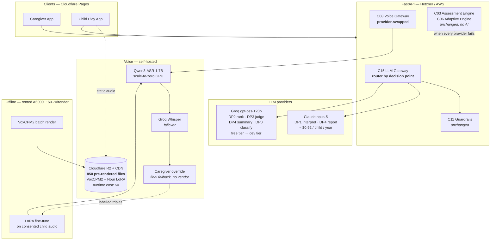

# 12 — Stack Revision: Groq + Self-Hosted Voice

**Status:** supersedes the model and voice-vendor choices in [03 §2](03-ai-architecture.md), [04d](04d-components-voice.md), [00 §C and §D1/D4](00-assumptions.md), and the cost model in [01 §8.4](01-hld.md). The *architecture* is unchanged — every guardrail, every fallback, every closed-set constraint stands. Only the providers behind C15 and C08 change, which is exactly what those components were designed to allow.

Two questions were asked. They have different answers.

> **Groq free tier: yes for development and the pilot, no for production — and here is precisely where it breaks.**
> **The DigitalTwins voice stack: yes, and it is a genuine upgrade over the Azure design, not a cost compromise.**

---

## 1. Groq free tier — the arithmetic

Verified limits ([Groq rate limits](https://console.groq.com/docs/rate-limits)):

| Limit | Free tier |
|---|---|
| Requests / minute | 30 |
| Requests / day | 1,000 |
| Tokens / minute | 8,000 |
| Tokens / day | 200,000 |
| Audio seconds / hour | 7,200 |
| Audio seconds / day | 28,800 |

### What the original design costs, in tokens

The prompt layout in [03 §3.2](03-ai-architecture.md) was built around **Anthropic prompt caching**: a large frozen prefix (~4,900 tokens of system prompt, rubric and few-shot examples) is cheap because cached reads bill at one-tenth. **Groq has no equivalent**, so that same prefix is paid at full price on every single call. The design's biggest cost optimisation becomes its biggest cost liability.

| Workload | Calls | Original tokens | Free tier TPD (200,000) |
|---|---|---|---|
| One PGEE assessment | ~115 | **≈ 470,000** | **2.4× the entire platform's daily budget** |
| One play session | ~4 | ≈ 20,000 | 10 sessions/day, platform-wide |

And `TPM = 8,000` is worse than `TPD` here: a single 5,000-token interpret call nearly exhausts the per-minute budget, so a caregiver would wait roughly **40 seconds between assessment questions**. That is not a slow product; it is a broken one.

### What it costs after restructuring for Groq

The fix is not to accept the limits — it is to **rewrite the prompts for a no-cache world**. Drop the six-example few-shot block to three, compress the rubric, and pass the item criterion instead of the whole bank slice:

| Workload | Calls | Revised tokens | Free tier capacity |
|---|---|---|---|
| PGEE — interpret | 55 × ~800 | 44,000 | |
| PGEE — rank | 55 × ~400 | 22,000 | |
| PGEE — report | 1 × ~6,000 | 6,000 | |
| **One assessment** | **~115** | **≈ 72,000** | **2.7 assessments/day, platform-wide** |
| **One play session** | 4 | ≈ 6,000 | **33 sessions/day, platform-wide** |

At 30 RPM and 8,000 TPM, a 55-item assessment now takes **≈ 6 minutes of API time** spread across a session the caregiver takes 20 minutes to complete. That works.

### Where it breaks

| Scenario | Daily token need | Free tier | Verdict |
|---|---|---|---|
| Development, 1 engineer | ~30,000 | 200,000 | ✅ comfortable |
| Demo / investor walkthrough | ~80,000 | 200,000 | ✅ fine |
| **Pilot — 8 families, 1 session/day + 8 assessments over 6 weeks** | ~50,000 | 200,000 | ✅ **fits with room** |
| 100 children | ~420,000 | 200,000 | ❌ 2.1× over |
| **2,500 children (MVP target)** | **≈ 10,500,000** | 200,000 | ❌ **52× over** |

Audio is the friendlier half. Whisper on Groq's free tier gives 28,800 audio-seconds/day; the pilot needs ~240 s/day and 2,500 children need ~52,500 s/day — only 1.8× over, not 52×.

**Conclusion:** Groq free tier covers development, demos, and the entire 8-family pilot. It cannot carry production, and no amount of prompt trimming closes a 52× gap. That is fine — the pilot is where you learn whether the product works, and by the time you need Tier C you will know whether it deserves the spend.

---

## 2. Model quality — the part that actually matters

Cost is the easy question. The hard one:

> Can an open-weight model on Groq interpret a tired Egyptian mother's description of her child as reliably as Claude Opus 5?

**DP1 (interpret) is the hardest task in the product.** It has to read `"بيحاول بس مش بيعرف"` and return `emerging`, not `yes`. It has to catch that `"لما بفكّره"` means prompted, therefore not independent, therefore `emerging`. It has to notice a red flag buried in an answer about something else. Getting this wrong does not produce a bad user experience — it corrupts a developmental record that a clinician will later act on.

Egyptian colloquial Arabic is also where open-weight models are weakest relative to frontier models. Their Arabic training data skews heavily MSA.

### The answer is not to choose — it is to route

C15 already routes per decision point. Use it:

| Decision point | Volume | Stakes | Recommended model | Why |
|---|---|---|---|---|
| **DP1 interpret** | 55 / assessment, **twice a year per child** | **Highest** — writes to a clinical record | **`claude-opus-5`** | Low volume, high stakes, hardest dialect task. See the cost below — this is nearly free. |
| **DP4 report** | 1 / assessment | High — a parent reads it | **`claude-opus-5`** | One call per six months per child. |
| DP2 rank / plan | 55 / assessment + 1 / session | Low — closed set, deterministic fallback | **Groq `openai/gpt-oss-120b`** | Picking one id from five. A small model does this fine. |
| DP3 mastery judge | 1 / session | Medium — clamped by L6 and a DB constraint | **Groq `openai/gpt-oss-120b`** | It can only withhold; the deterministic rule is the ground truth. |
| DP4 session summary | 1 / session | Low — 4 friendly lines, guardrailed | **Groq `openai/gpt-oss-120b`** | High volume, low stakes. |
| DP0 safety classify | every free text | High, but **fails closed** | **Groq + keyword pre-filter**, escalate on uncertainty | A miss escalates to a human rather than passing through. |

### What this costs per child per year

| Item | Volume | Cost |
|---|---|---|
| DP1 interpret — Opus 5, 2 assessments/year, cached prefix | 110 calls | **$0.62** |
| DP4 report — Opus 5, 2/year | 2 calls | **$0.30** |
| Everything else — Groq | ~1,000 calls | **$0.00** free / cents on Developer tier |
| **Total LLM per child per year** | | **≈ $0.92** |

Against the original design's ~$26/child/year, that is a **96% reduction while keeping frontier quality exactly where a mistake would hurt a child.** This is the recommendation.

### How to decide, rather than argue about it

You already have the instrument. `evals/datasets/interpret_ar.jsonl` is 120 double-annotated Egyptian-Arabic answers with a **≥ 95% exact-match gate**. Run it against both models and let the number decide:

```bash
just eval interpret --model claude-opus-5
just eval interpret --model groq/openai/gpt-oss-120b
just eval interpret --model groq/llama-3.3-70b-versatile
```

If an open model clears 95% with 100% red-flag recall, route DP1 to Groq too and take the last $0.62. If it lands at 88%, you have just learned that one in eight developmental judgements would be wrong, and the routing table above is the answer. **Do not decide this from a vibe check on ten examples** — the whole reason that dataset exists is to make this a measurement.

### One thing to fix before any of this ships

**Groq's free-tier data terms are not established.** The [privacy policy](https://groq.com/privacy-policy) defers customer data handling to the Services Agreement and DPA, which are not public. Before any pilot traffic — even pseudonymised — someone must read those and confirm: no training on our data, a stated retention period, and a signed DPA. This is child health-adjacent data in a PDPL jurisdiction.

This is **blocking for the pilot, not for development.** Develop against synthetic children today; resolve the terms before a real family's data moves.

---

## 3. The DigitalTwins voice stack — this one is a clear yes

[`ahmednasri05/DigitalTwins`](https://github.com/ahmednasri05/DigitalTwins) is a voice-to-voice professor-clone system for Ain Shams University. What it contains, and what transfers:

| Component in the repo | Transfers? | Why |
|---|---|---|
| **VoxCPM2 TTS + LoRA adapters** | ✅ **Directly, and it is an upgrade** | See §3.1 |
| **Qwen3-ASR-1.7B via vLLM** | ✅ **Directly, and it unlocks something Azure never could** | See §3.2 |
| **nano-vLLM fork with dynamic LoRA loading (`POST /loras`)** | ✅ Reuse as-is | One GPU serves several voices; no restart to swap adapters |
| **`stress_test.py`** | ✅ Reuse | Becomes the load harness for our voice tier |
| **Cloudflare Pages frontend hosting** | ✅ Adopt | Free, global, fast to Egypt — better than CloudFront for our static tier |
| **Prometheus + Grafana** | ✅ Already our choice ([08 §5](08-infrastructure.md)) | |
| **`uv` dependency management** | ✅ Already our choice | |
| **Thunder Compute RTX A6000 hosting** | ⚠️ Partially — see §3.3 | Cheapest verified A6000 at **$0.35/hr**, but a single GPU is a single point of failure |
| **Full-duplex WebSocket streaming with barge-in** | ❌ **Deliberately not** | Barge-in interrupts a speaker. Children with Down syndrome need long, uninterrupted pauses; a system that cuts in at 250 ms of silence would talk over them constantly. Our turn-based design ([00 C5](00-assumptions.md)) is correct for this population. |
| **`Preprocessing/` lecture-segmentation pipeline** | ❌ | Built for long-form English lectures; our corpus is 850 short scripted utterances |

### 3.1 TTS: VoxCPM2 beats Azure for *this* product

[VoxCPM2](https://github.com/OpenBMB/VoxCPM) is a 2B-parameter tokenizer-free TTS model trained on 2M+ hours across **30 languages including Arabic**, with **controllable voice cloning** and 48 kHz output.

The decisive fact is one we already established in [04d §2](04d-components-voice.md): **92% of everything the platform says is a fixed corpus of ~850 pre-generated utterances.** We are not buying a realtime TTS service. We are buying *one batch render*.

That changes the economics completely:

```
Record a real Egyptian woman — ideally an early-intervention specialist or a
mother who naturally speaks to small children — for 20–30 minutes.
        │
        ├─► VoxCPM2 voice clone / LoRA adapter  ──►  "نور" (Nour)
        │
        └─► Rent an A6000 for ~2 hours at $0.35/hr
                 │
                 └─► Batch-render all 850 utterances at 48 kHz
                          │
                          └─► Normalise to −16 LUFS → Opus → Cloudflare R2 + CDN
                                   │
                                   └─► GPU shut down. Runtime cost: $0.
```

**Total one-time cost: ≈ $0.70 of GPU time.** Runtime cost: zero, forever. Serving cost: 35 MB on R2 with free egress — effectively nothing.

Per-child name clips (~10 per child) are generated in a batch job at signup: 2,500 children × 10 clips ≈ one GPU-day ≈ **$8, once**.

Why this is *better* than Azure `ar-EG-SalmaNeural`, not merely cheaper:

1. **A real Egyptian voice, chosen by us.** Not a vendor's idea of Egyptian Arabic — an actual person we picked because she sounds like someone's mother.
2. **Permanent consistency.** [Assumption C7](00-assumptions.md) says Nour's voice must never change, because voice consistency is a comprehension aid for this population. With a hosted API, the vendor can update the voice model underneath you. With a local adapter and rendered files, it is frozen by construction.
3. **No vendor dependency in the child's critical path.** The child app plays static files from a CDN. Azure could disappear entirely and no child would notice.
4. **Prosody control for teaching.** We can tune rate, emphasis and pause length per utterance during the render, iterate with a speech therapist, and re-render for $0.70.

**Before committing:** a native Egyptian speaker must listen to a VoxCPM2 Arabic sample set. "Supports Arabic" is not "sounds right in Egyptian." Render 20 of our actual skill labels — including the ones that expose dialect (`جزمة` must be /gazma/, not /dʒazma/) — and have them judged blind against Azure. That listening test is a half-day and it decides the whole voice tier.

### 3.2 ASR: Qwen3-ASR-1.7B unlocks the one thing we could not otherwise fix

[Qwen3-ASR-1.7B](https://huggingface.co/Qwen/Qwen3-ASR-1.7B) covers **52 languages and dialects including Arabic**, is state-of-the-art among open-source ASR, and is competitive with commercial APIs.

But its real value is not accuracy today. It is this, from [04d](04d-components-voice.md):

> No commercial ASR is validated on the speech of Egyptian Arabic-speaking children with Down syndrome.

That problem has no API solution, because the training data does not exist. It has exactly one solution: **collect the data and fine-tune.** Open weights make that possible; a hosted API never will. And the DigitalTwins repo already contains the LoRA training pipeline.

The flywheel was already designed into the product without this being the reason:

```
Caregiver taps "قالها صح ✅"  (the override from 04d §3)
        │
        └─► a labelled triple: (audio, expected_word, confirmed_correct)
                 │
     pilot: 8 children × 6 weeks ≈ 3,000–5,000 labelled utterances
                 │
                 └─► LoRA fine-tune Qwen3-ASR on Down-syndrome Egyptian child speech
                          │
                          └─► measurable WER improvement on exactly our population
                                   │
                                   └─► a dataset and a model nobody else has
```

The caregiver-override button stops being a graceful fallback and becomes the data-collection mechanism for a defensible asset. This is the strongest strategic argument in favour of the repo's approach, and I would take it even if the hosted APIs were free.

Gated, as ever, on `voice_retention` consent ([02 §3](02-data-model.md)) — which is opt-in, 30-day TTL, and off by default. Fine-tuning uses only consented audio.

### 3.3 Hosting

| Tier | What runs | Where | Cost |
|---|---|---|---|
| **Static** — child app, caregiver app, 850 audio files, images | Cloudflare Pages + R2 | Cloudflare | **~$0–5/mo** (free egress) |
| **API + Postgres + Redis** | FastAPI, ARQ, PG16, Redis | Hetzner CX32 ×2 + Coolify, or AWS `me-south-1` | **$95/mo** (Hetzner) or **$480/mo** (AWS) |
| **TTS render** | VoxCPM2 batch | Rented A6000, **on demand only** | **~$0.70 per full re-render** |
| **ASR inference** | Qwen3-ASR-1.7B via vLLM | A6000, scale-to-zero when idle | **$0** pilot (Groq Whisper free) → **~$60–256/mo** at scale |

**Adopt the repo's Cloudflare Pages choice.** For a static tier served to Egypt, Cloudflare's edge presence and zero egress beat CloudFront on both latency and price, and it removes the CDN line item entirely.

**Do not adopt a single always-on A6000 as the production ASR tier without redundancy.** One GPU on one provider is a single point of failure in a live child-facing path. Mitigations, in order of preference:

1. **Pilot:** use **Groq's free Whisper** for ASR (28,800 audio-sec/day covers 8 families ~120× over). No GPU at all. Self-hosted ASR arrives only when the fine-tuned model justifies it.
2. **Production:** scale-to-zero GPU with **Groq Whisper as the automatic failover**, plus the caregiver-confirmation mode that already exists as the second fallback. Three layers deep, and the third requires no vendor at all.

### 3.4 Licensing — verify before you build on it

Check and record in an ADR, because both are load-bearing:

- **VoxCPM2** model weights — commercial-use terms, and whether a cloned voice derived from a consented recording carries any restriction.
- **Qwen3-ASR-1.7B** — licence terms for commercial use and for distributing a fine-tuned derivative.
- **Voice talent release** — the person whose voice becomes Nour signs a perpetual, transferable licence for synthetic reproduction. This is a real contract, not a formality; you are cloning someone's voice and shipping it to thousands of children.

### 3.5 Rejected: Groq's Arabic TTS

Groq offers [`canopylabs/orpheus-arabic-saudi`](https://console.groq.com/docs/text-to-speech). Two disqualifiers:

1. **It is Saudi dialect.** For a child learning their first spoken words, this is not cosmetic. Egyptian ج is /g/; Saudi is /dʒ/. An Egyptian child taught `جزمة` as /dʒazma/ learns a word they will not hear at home and that their family will not recognise. The entire product is built on the child mapping a sound to an object in their own house.
2. **It is a preview model**, and Groq's own documentation states preview models are "intended for evaluation purposes only" and should not be used in production.

Orpheus is a fine option for a different product. Not this one.

---

## 4. Revised architecture

Unchanged: every guardrail layer, every closed-set constraint, every deterministic fallback, the assessment engine, the BKT model, the DB constraint that stops an AI granting mastery. **That was the point of putting all AI behind C15 and all voice behind C08** — swapping vendors is a config change, and here it is.



### Revised cost model

| Tier | Children | LLM | Voice | Infra | **Total / month** |
|---|---|---|---|---|---|
| **A — Development** | 0 real | Groq free | VoxCPM2 local + Groq Whisper free | local Docker | **$0** |
| **B — Pilot (8 families)** | 8 | Groq free + ~$3 Opus 5 total | pre-rendered ($0.70 once) + Groq Whisper free | Hetzner $95 + CF $0 | **≈ $98** |
| **C — Production** | 2,500 | ~$190 (Opus 5 DP1/DP4) + Groq dev tier | pre-rendered $0 + ASR GPU $60–256 | Hetzner $95 or AWS $480 | **≈ $345–925** |

Tier C works out at **$0.14–0.37 per child per month**, against the original design's $4.20. The saving comes from three places, in order of size: pre-rendered TTS instead of per-request synthesis, routing low-stakes calls to a free/cheap model, and self-hosted ASR replacing per-second billing.

---

## 5. What changes in the build

Six focused deltas. Everything else in [09](09-build-prompts.md) stands.

### Δ1 — P03 gateway becomes multi-provider

```
REVISION TO P03 (LLM Gateway)

Add a provider abstraction beneath call_structured(). The guardrail chain, the
pseudonymiser, the budget guard, the flags and the ai_calls audit row are UNCHANGED
and remain provider-agnostic.

  class LlmProvider(Protocol):
      async def complete_structured(self, *, system, messages, schema,
                                    effort, max_tokens) -> ProviderResult: ...

  AnthropicProvider  — claude-opus-5, thinking adaptive, output_config format+effort,
                       cache_control on frozen blocks, betas server-side-fallback,
                       stop_reason "refusal" handling
  GroqProvider       — OpenAI-compatible endpoint, response_format json_schema,
                       NO prompt caching, NO thinking parameter, NO effort parameter;
                       map our effort tiers onto max_tokens and prompt verbosity instead
  FixtureProvider    — replays recordings; the CI default

Route per decision point from config, not from code:

  PROVIDER_BY_DECISION = {
      "pgee_interpret":  "anthropic",   # highest stakes — see docs/12 §2
      "pgee_report":     "anthropic",
      "pgee_next_item":  "groq",
      "tutor_plan":      "groq",
      "tutor_judge":     "groq",
      "tutor_summary":   "groq",
      "safety_classify": "groq",
  }

Add a per-provider PROMPT VARIANT. Groq variants must be short — no 2,600-token
few-shot block, because there is no cache to amortise it. Target ≤ 800 input tokens
for interpret and ≤ 400 for rank. Register them in the PromptStore as
pgee_interpret@v1-groq alongside pgee_interpret@v1.

Add Groq rate-limit handling: 30 RPM / 8,000 TPM free tier. Implement a token-bucket
limiter in the gateway that QUEUES rather than fails, and surfaces queue depth as a
metric. On 429, exponential backoff, then fall through to the deterministic path.

ACCEPTANCE CRITERIA (in addition to the original P03 list)
- The same decision point produces a schema-valid result through all three providers
- Switching a decision point's provider requires ONE config line and no code change
- The Groq prompt variant for pgee_interpret is ≤ 800 input tokens — assert with a
  token count test
- Sustained 60 RPM against the free tier produces zero errors and zero dropped
  requests — only queueing and, at the limit, clean deterministic fallback
- A provider outage on one decision point does not affect the others
- ai_calls records `provider` alongside `model`, and cost is computed per provider
```

### Δ2 — P09 voice replaced by a render pipeline plus a thin ASR client

```
REVISION TO P09 (Voice Gateway)

REPLACE AzureTts with a pre-render pipeline. There is no runtime TTS provider in the
child's path at all.

BUILD
1. tools/voice_render/ — an offline batch renderer, NOT part of the API service:
   - loads VoxCPM2 + the Nour LoRA adapter
   - reads the utterance inventory (~850 items) from the content DB
   - renders at 48 kHz, normalises to -16 LUFS, encodes to 48 kbps Opus
   - uploads to Cloudflare R2 and writes tts_cache rows
   - idempotent by content hash; re-running renders only what changed
   - designed to run on a rented A6000 and then be shut down
2. tools/voice_render/child_names.py — per-child name clip generation, triggered as an
   ARQ job at signup, batched nightly
3. AsrProvider implementations:
   - QwenAsrProvider  — Qwen3-ASR-1.7B over vLLM (reuse the DigitalTwins vLLM config)
   - GroqWhisperProvider — automatic failover
   - NullAsr — tests
   Failover order: Qwen → Groq Whisper → caregiver-confirmation mode
4. KEEP UNCHANGED: normalize_ar, g2p, phoneme_similarity, the substitution-cost matrix,
   the 0.55 threshold, the three verdicts, accept-on-effort, the caregiver override.
   None of that depended on the vendor.
5. NEW: tools/asr_finetune/ — export consented (audio, expected_word, confirmed) triples
   into a LoRA training set. Adapt the DigitalTwins training pipeline. Gated on
   voice_retention consent; must refuse to export anything without it.

ACCEPTANCE CRITERIA
- The full 850-utterance corpus renders in under 3 GPU-hours and costs under $2
- Loudness across the rendered corpus is within ±1 LUFS
- A NATIVE EGYPTIAN SPEAKER blind-rates 20 rendered skill labels against the Azure
  equivalents and VoxCPM2 wins or ties on intelligibility and dialect authenticity.
  THIS IS A GATE — if it loses, keep Azure for TTS and take the rest of this revision.
- Dialect check: جزمة renders as /gazma/, جبنة as /gebna/ — assert by native review,
  not by a metric
- The child app plays only static R2 URLs; a test asserts zero TTS calls during a
  full play session
- Qwen ASR down → Groq Whisper transparently; both down → caregiver-confirmation;
  the session completes in all three cases
- The fine-tune exporter refuses to emit any row lacking voice_retention consent
```

### Δ3 — Hosting

```
REVISION TO P15 (Infrastructure)

- Move the static tier to Cloudflare Pages + R2. Drop CloudFront and the S3 media
  bucket. Keep S3 (or R2) for private artefacts: exports, consented audio.
- Default the API tier to Hetzner + Coolify ($95/mo). Keep the AWS Terraform as the
  documented scale-up path; it is written and does not need deleting.
- Add a scale-to-zero GPU module for ASR (Thunder Compute A6000 at $0.35/hr verified,
  or an equivalent provider) with Groq Whisper as the health-check failover.
- Add tools/voice_render as a one-off job spec, not a service.
- Extend the cost dashboard with a `provider` dimension.
```

### Δ4 — Evals become the deciding instrument

Run every suite in [10](10-test-prompts.md) against **both** providers and publish the comparison. `interpret_ar.jsonl` at ≥ 95% with 100% red-flag recall is the gate that decides whether DP1 can move to Groq. Add `--model` and `--provider` flags to the eval runner and store results per provider so the comparison is reproducible.

### Δ5 — Assumption updates

| Original | Revised |
|---|---|
| **C1** Azure `ar-EG-SalmaNeural` | **VoxCPM2 + a cloned Egyptian voice**, batch-rendered offline. Azure retained as the documented fallback if the native-speaker listening test fails. |
| **C2** ~92% pre-generated | **~100% pre-generated.** There is no runtime TTS in the child's path. |
| **C3** Azure ASR + OpenAI fallback | **Qwen3-ASR-1.7B self-hosted → Groq Whisper → caregiver confirmation.** |
| **D1** `claude-opus-5` everywhere | **Routed per decision point**: Opus 5 for DP1/DP4-report, Groq for the rest. Justified by measurement, not preference. |
| **D4** AWS `me-south-1` | **Cloudflare Pages + R2 for static; Hetzner for the API**; AWS documented as the scale path. |
| — | **NEW C8:** The Nour voice is cloned from a consented recording of a real Egyptian speaker under a perpetual synthetic-reproduction licence. |
| — | **NEW D10:** Groq free tier is a development and pilot tier. Production requires Developer tier. Free-tier data terms must be confirmed before pilot traffic. |

### Δ6 — Roadmap changes

Insert into [11](11-integration-roadmap.md):

- **Week 1** — add: Groq DPA and Services Agreement review (blocking for pilot); VoxCPM2 and Qwen3-ASR licence review.
- **Week 2** — add: cast and record the Nour voice talent (20–30 min, studio-quality, with a signed release). This is on the critical path and has a human lead time; start it early.
- **Week 6** — add: VoxCPM2 Arabic listening test with a native speaker. **Gate:** ship VoxCPM2 or fall back to Azure.
- **Week 8** — add: run the eval suite across providers; freeze the routing table with the numbers attached.
- **Week 11** — change: "native-speaker TTS pronunciation review" now reviews the *rendered corpus*, which is more valuable — they are checking the actual files that ship.
- **Week 20 (pilot end)** — add: export the consented ASR corpus, run the first LoRA fine-tune, measure WER against the baseline. This is the first evidence that the flywheel works.

---

## 6. Summary

| Question | Answer |
|---|---|
| Groq free tier for production? | **No** — 52× short on tokens at 2,500 children, and no prompt caching to close it. |
| Groq free tier for development and the pilot? | **Yes**, comfortably, after restructuring the prompts for a no-cache world. |
| Groq for all decision points? | **Not yet — measure first.** Route DP1 and DP4-report to Opus 5 until `interpret_ar.jsonl` says otherwise. It costs $0.92/child/year to be safe. |
| Groq's Arabic TTS? | **No.** Saudi dialect and preview status. Both are disqualifying for a child learning first words. |
| DigitalTwins VoxCPM2 for TTS? | **Yes — and it is better than the Azure design**, because ~100% of our audio is a fixed corpus and voice cloning gives us a real Egyptian voice, frozen forever, at zero runtime cost. |
| DigitalTwins Qwen3-ASR for STT? | **Yes**, and it is the only path to solving child-speech recognition for this population, because open weights let us fine-tune on data we already collect. |
| DigitalTwins hosting? | **Cloudflare Pages: yes.** Single always-on A6000: not without failover. Rented GPU for batch rendering: yes, ~$0.70 a run. |
| Does the architecture change? | **No.** Every guardrail, fallback and constraint is untouched. This is a provider swap behind C15 and C08 — which is what they were built for. |

**Bottom line:** this revision cuts cost by roughly 95%, removes two vendor dependencies from the child's critical path, gives you an authentically Egyptian voice you own outright, and opens the one route to child-speech recognition that actually exists for this population. The trade is that you must *measure* interpretation quality rather than assume it — and you already built the instrument to do that.
